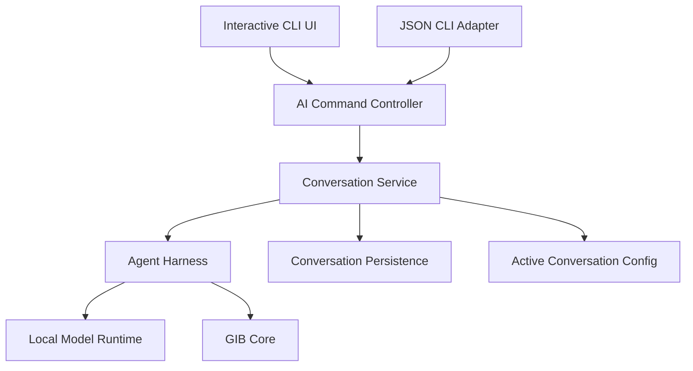
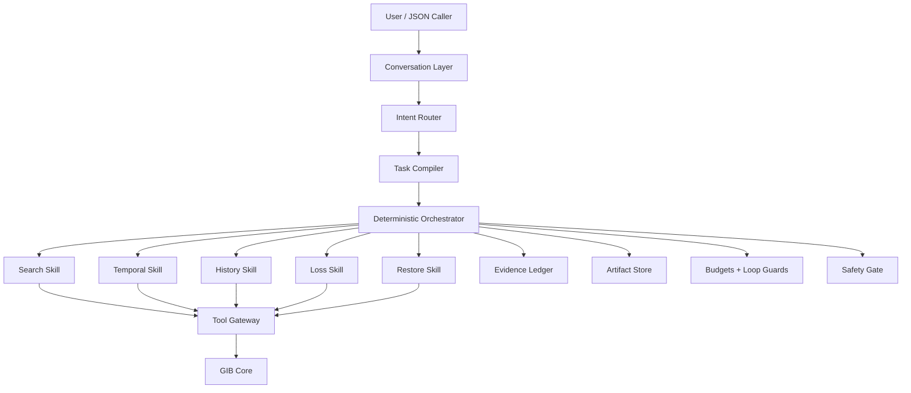

# GIB AI Architecture Specification

**Status:** Proposed architecture  
**Audience:** GIB maintainers, contributors, AI/agent engineers, and developers integrating new GIB AI capabilities  
**Scope:** Local-first AI runtime, persistent conversational CLI frontend, agent harness, historical file intelligence, and safe GIB operations

---

# 1. Purpose

This document is the technical source of truth for **GIB AI**.

It defines:

- the user-facing goals of GIB AI;
- how the local model is distributed, installed, configured, and executed;
- how `gib ai` behaves in interactive and JSON modes;
- how conversations are persisted and resumed across processes;
- how a small local model is wrapped in a strong deterministic harness;
- which responsibilities belong to Rust and which belong to the LLM;
- how routing, planning, evidence, tools, search, history, time travel, and restore work;
- how safety is enforced;
- how the architecture is evaluated and extended.

This is not a prompt-writing guide.

GIB AI must be treated as a **software system with a language model inside it**, not as a language model with unrestricted access to GIB.

The intended default model is intentionally small and local. The harness, CLI runtime, state model, evidence system, and deterministic GIB core are therefore first-class components of the product.

---

# 2. Product Vision

GIB already turns backups into a versioned historical filesystem.

GIB AI should turn that filesystem history into something users can reason about naturally.

The user should not need to know:

- the exact filename;
- the exact path;
- the backup hash;
- the revision ID;
- which snapshot contained a file;
- when the file disappeared;
- which command should restore it.

The user should be able to say:

> "Find the identity document I had last week."

> "Where did my contract go?"

> "Restore the latest resume I had in Downloads."

> "Show me this folder before I deleted those files."

> "What happened to my project yesterday?"

The long-term product idea is:

> **The user should be able to ask questions about files they have now, files they used to have, and how those files changed over time.**

The AI is not merely a natural-language wrapper around CLI commands.

It is a **local historical filesystem agent**.

---

# 3. MVP Product Capabilities

The first meaningful GIB AI version should focus on five related capabilities.

## 3.1 Investigative Search

The user may describe a file without knowing its exact name or location.

Examples:

> "Find my identity document from last week."

> "I had a PDF related to rent a few months ago."

> "Find the file I deleted from Downloads yesterday."

The system must not translate the request into one literal search and stop.

It must be able to:

1. interpret the target;
2. extract time, path, type, and historical-state hints;
3. form a bounded set of hypotheses;
4. run a specific search;
5. evaluate the results;
6. broaden or change search strategy when necessary;
7. avoid repeating searches that already failed;
8. compare candidates;
9. stop when a target is resolved, ambiguity requires the user, or reasonable search strategies are exhausted.

Investigative Search is the foundation for the other capabilities.

---

## 3.2 File Loss Explanation

The user should be able to ask:

> "Where did this file go?"

> "When was this deleted?"

> "What happened to `contract.pdf`?"

The system should explain known historical facts such as:

- first known appearance;
- last known presence;
- first historical state in which the path is absent;
- available revisions;
- latest restorable revision;
- probable move/rename evidence;
- uncertainty about the exact real-world cause.

The system must distinguish facts from inference.

Fact:

> The file was present in the 18:32 snapshot and absent in the 19:04 snapshot.

Inference:

> It probably disappeared, moved, was renamed, or left the backup scope during that interval.

The AI must never invent an exact deletion cause or timestamp that GIB did not observe.

---

## 3.3 Intent-Based Restore

The user should be able to say:

> "Restore the latest version of my driver's license."

> "Bring back the folder I deleted yesterday."

> "Restore the resume I had last month."

The system should:

1. resolve the target;
2. resolve temporal constraints;
3. deterministically resolve the correct historical revision;
4. create a restore preview;
5. run safety checks;
6. request confirmation when required;
7. execute an immutable precomputed plan;
8. verify the result.

The LLM must never create and execute arbitrary shell commands.

---

## 3.4 Natural-Language Time Travel

Users should be able to refer to time naturally:

> "How was this file last Tuesday?"

> "Give me the last version before yesterday."

> "Show me the version before it disappeared."

The model interprets language.

Rust resolves actual timestamp intervals and selects revisions.

---

## 3.5 History Explanation — "What Happened?"

The user should be able to ask:

> "What happened in this folder this week?"

> "What changed in my project yesterday?"

> "What happened before this file disappeared?"

GIB should deterministically aggregate history into useful events such as:

- additions;
- removals;
- modifications;
- directory disappearance;
- deletion bursts;
- modification bursts;
- large churn;
- probable moves/renames.

The LLM explains and prioritizes those events instead of reading thousands of raw manifest records.

---

# 4. MVP Non-Goals

The architecture should support these later, but they must not block the initial MVP.

## 4.1 Full content understanding

Future versions may index or inspect:

- PDF text;
- OCR from images;
- Office documents;
- source-code semantics;
- image descriptions;
- embeddings;
- EXIF and rich media metadata.

This will eventually make requests such as:

> "Restore the latest photo of my driver's license."

work even if the file is called `IMG_20260817_142233.jpg`.

## 4.2 General natural-language administration

The first MVP does not need to expose every GIB operation through AI, including storage creation, prune, retention design, encryption setup, or repair.

## 4.3 Autonomous destructive maintenance

The AI must not independently delete backups, prune storage, or replace large filesystem states.

---

# 5. Core Architectural Principle

The central design rule is:

> **Use the model only for decisions that genuinely require semantic interpretation or ambiguous reasoning. Everything deterministic should be implemented in Rust.**

Examples:

| Problem | Owner |
|---|---|
| Interpret "last week" | LLM + date normalization |
| Select a revision whose interval contains a timestamp | Rust |
| Understand that "CNH" relates to a driver's license | LLM |
| Sort candidates by timestamp | Rust |
| Detect repeated tool calls | Rust |
| Choose the next useful search strategy | LLM |
| Verify that a file exists in the catalog | Rust |
| Decide whether overwrite requires confirmation | Rust |
| Explain historical evidence naturally | LLM |
| Verify restored content hash | Rust |

The model is a semantic decision engine.

GIB core is the source of truth.

---

# 6. Local Model Strategy

The default runtime should use a local Qwen3.5-4B-class Q4 GGUF through llama.cpp bindings.

The AI subsystem must not require Ollama, LM Studio, a local HTTP server, or `llama-server`.

The model should be loaded **in-process** from Rust.

The exact model may change over time, so the architecture must expose a model abstraction rather than spread llama.cpp-specific code through the project.

Suggested interface:

```rust
pub trait AiBackend {
    fn generate_structured<T: DeserializeOwned>(
        &mut self,
        request: StructuredGenerationRequest,
    ) -> Result<T, AiError>;

    fn generate_text(
        &mut self,
        request: TextGenerationRequest,
    ) -> Result<String, AiError>;

    fn capabilities(&self) -> ModelCapabilities;
}
```

---

# 7. Model Distribution and Installation

Users should not need to know what GGUF, Hugging Face, llama.cpp, or quantization mean.

The normal user flow should be:

```bash
gib ai
```

If the configured model is not installed, GIB should offer or automatically perform the supported installation flow.

Suggested model location:

```text
~/.gib/ai/models/
```

Each supported model should have an immutable manifest.

```rust
pub struct ModelManifest {
    pub id: String,
    pub display_name: String,
    pub version: String,
    pub download_url: String,
    pub sha256: String,
    pub expected_size: u64,
    pub quantization: String,
    pub license: String,
    pub source: String,
}
```

Recommended model installation pipeline:

```text
resolve configured model
        ->
check local artifact
        ->
validate size/hash
        ->
resume/download if missing
        ->
verify SHA-256
        ->
atomically install
        ->
record installed model metadata
```

Downloads should support progress and resume where practical.

A failed or partial download must not be treated as an installed model.

Model URLs should be versioned and immutable.

GIB may mirror supported GGUF artifacts on infrastructure controlled by the project while preserving model license and attribution requirements.

---

# 8. Runtime Profiles and Hardware Detection

GIB should detect enough local hardware information to choose safe defaults.

Possible inputs:

- RAM;
- CPU architecture;
- CPU thread count;
- supported acceleration backend;
- available GPU/offload capabilities.

Suggested profiles:

```rust
pub enum AiQualityProfile {
    LowMemory,
    Balanced,
    HighQuality,
}
```

Profiles may adjust:

- context size;
- inference threads;
- GPU layers/offload;
- search beam width;
- optional critic calls;
- self-consistency count;
- maximum agent budget.

Safety guarantees must never depend on the quality profile.

---

# 9. `gib ai` Is a Core Product Surface

The `gib ai` command is not a final polish task.

It must be introduced early and become the primary integration surface used while the rest of the harness is developed.

The system has two presentation modes:

```text
Interactive terminal mode
        +
Machine-readable JSON mode
```

Both modes MUST use the same:

- conversation service;
- selected conversation;
- local model runtime;
- AgentSession construction;
- orchestrator;
- tools;
- safety system;
- GIB core.

There must never be one implementation for interactive mode and another independent implementation for JSON mode.



---

# 10. Interactive `gib ai` Mode

Running:

```bash
gib ai
```

should open the currently selected persistent conversation.

The interface should feel like a modern terminal chat application, not like repeatedly executing isolated shell commands.

At minimum, interactive mode should provide:

- a clear GIB AI header;
- active conversation title or short ID;
- active model information;
- repository context when relevant;
- multiline input;
- streamed assistant output;
- high-level agent activity;
- progress for long operations;
- safe confirmation prompts;
- readable tool/result summaries;
- persistent chat history;
- terminal resize handling;
- clean Ctrl+C/Ctrl+D behavior;
- graceful fallback for limited terminals.

The frontend may display activity such as:

```text
Searching historical files...
Expanding search to PDFs from last week...
Comparing 6 candidates...
Inspecting file history...
Preparing restore...
```

It MUST NOT display hidden chain-of-thought or raw internal model reasoning.

A first implementation can be a polished streaming chat interface. It does not need to start as a complex full-screen TUI.

Suggested conceptual components:

```text
AiInteractiveApp
├── Header
├── ConversationViewport
├── AgentActivityView
├── ConfirmationView
├── Composer
└── StatusBar
```

The frontend should consume structured harness events rather than parse human-readable logs.

---

# 11. JSON Mode

Automation and external tools must be able to use the same active conversation.

Example:

```bash
gib ai --mode json --message "find the contract I had last week"
```

The command must:

1. load the currently selected conversation;
2. append the user message;
3. execute the same runtime/harness used by interactive mode;
4. append the resulting assistant turn;
5. persist durable turn context;
6. return a stable JSON result.

A second process invocation:

```bash
gib ai --mode json --message "restore the latest one"
```

must continue the same conversation unless the caller explicitly selects another conversation.

The caller must not need to resend prior chat history.

JSON stdout must remain machine-readable.

It must not contain:

- ANSI escape codes;
- spinners;
- interactive prompts;
- arbitrary human-only status lines.

Suggested response envelope:

```json
{
  "schema_version": 1,
  "conversation": {
    "id": "conv_01...",
    "title": "Contract recovery"
  },
  "message": {
    "id": "msg_01...",
    "role": "assistant",
    "content": "I found two likely files..."
  },
  "status": "completed",
  "requires_confirmation": false,
  "artifacts": [],
  "events": [
    {
      "type": "search_completed",
      "summary": "Found 6 historical PDF candidates"
    }
  ]
}
```

The JSON contract must be versioned.

---

# 12. Persistent Conversations

Conversation continuity must survive process exits.

Each conversation should be stored in its own file.

Suggested layout:

```text
~/.gib/
└── ai/
    ├── config.toml
    ├── models/
    │   └── ...
    └── conversations/
        ├── conv_01J....json
        ├── conv_01K....json
        └── conv_01M....json
```

The exact root may reuse existing GIB configuration conventions, but AI state must remain separate from repository backup data.

Suggested conversation type:

```rust
pub struct PersistedConversation {
    pub schema_version: u32,
    pub id: ConversationId,
    pub title: Option<String>,
    pub created_at: DateTime,
    pub updated_at: DateTime,
    pub revision: u64,
    pub messages: Vec<PersistedMessage>,
    pub context: PersistedConversationContext,
}
```

Messages should have stable IDs:

```rust
pub struct PersistedMessage {
    pub id: MessageId,
    pub role: ConversationRole,
    pub content: String,
    pub created_at: DateTime,
    pub turn_metadata: Option<PersistedTurnMetadata>,
}
```

Raw hidden reasoning must never be persisted.

Large raw tool outputs should not be blindly copied into conversation files.

Persist compact summaries, structured references, and useful artifacts instead.

---

# 13. Active Conversation Configuration

The selected conversation must be stored separately from individual conversation files.

Example:

```toml
version = 1

[model]
active = "qwen3.5-4b-q4-k-m-v1"

[conversation]
active = "conv_01J..."
```

This creates the required behavior:

```bash
gib ai
```

and:

```bash
gib ai --mode json --message "..."
```

resume the same logical conversation.

Changing the selected conversation must update the config atomically.

---

# 14. Conversation Management

The CLI architecture should support operations equivalent to:

```bash
gib ai conversation new
gib ai conversation list
gib ai conversation select <id>
gib ai conversation show <id>
gib ai conversation rename <id> <title>
gib ai conversation delete <id>
```

Interactive mode should expose equivalent conveniences such as:

```text
/new
/conversations
/switch
/rename
/exit
```

Exact syntax may evolve, but both modes must call the same `ConversationService`.

For automation, an explicit conversation override should be supported:

```bash
gib ai --mode json \
  --conversation conv_01J... \
  --message "restore the latest one"
```

Recommended semantics:

- no `--conversation`: use active conversation;
- `--conversation <id>`: use that conversation for the invocation;
- selecting the global active conversation is a separate operation;
- creating a new conversation must be explicit.

This prevents automation from unexpectedly replacing the human user's selected conversation.

---

# 15. Conversation Persistence Safety

Conversation writes must be safe.

Recommended write path:

```text
serialize
   ->
write temporary file
   ->
flush/sync where appropriate
   ->
atomic rename
```

The selected-conversation config should use the same approach.

Concurrent invocations must not silently overwrite each other.

Use explicit locking and/or revision checks.

For example, two simultaneous commands:

```bash
gib ai --mode json --message "A"
gib ai --mode json --message "B"
```

must either serialize access or detect a revision conflict.

A failed AI turn must not corrupt the conversation.

The submitted user message and a structured failed-turn record may remain durable so the user can understand what happened and retry.

---

# 16. Conversation vs Agent Session

A **Conversation** and an **AgentSession** are not the same thing.

A Conversation is long-lived and user-facing.

An AgentSession is bounded execution state for a single user turn/workflow.

```text
Conversation
   |
   +-- user message
   |
   +-- create AgentSession
   |      |
   |      +-- route
   |      +-- search
   |      +-- evidence
   |      +-- planning
   |      +-- optional restore
   |
   +-- assistant message
   |
   +-- compact durable turn context
```

Do not serialize the entire in-memory AgentSession into the conversation.

Persist only what is useful for later turns.

Suggested durable context:

```rust
pub struct PersistedConversationContext {
    pub last_resolved_targets: Vec<ResolvedTargetReference>,
    pub last_resolved_revision: Option<ResolvedRevisionReference>,
    pub last_temporal_constraint: Option<TemporalConstraintReference>,
    pub last_repository: Option<RepositoryReference>,
    pub rolling_summary: Option<String>,
}
```

This makes follow-ups such as:

> "Restore it."

> "Give me the previous one."

> "What happened before that?"

possible without re-running the entire previous investigation.

---

# 17. Conversation Context Resolver

Before Intent Routing, the system should create a compact context for the new turn.

It should resolve references such as:

```text
that file
the latest one
restore it
before that
show me the previous version
```

Structured references from previous turns should be preferred over re-reading an arbitrarily long transcript.

As conversations grow, old history should be compacted into a rolling structured summary rather than continuously expanding model context.

The raw transcript remains persisted for user history, but the model-facing context should be intentionally bounded.

---

# 18. Why the Harness Must Be Strong

Small local models are useful for narrow semantic decisions but less reliable when asked to autonomously control long multi-step trajectories.

Common weak points include:

- maintaining long plans;
- remembering every previous tool call;
- avoiding loops;
- choosing among many tools;
- handling huge observations;
- safely performing mutations;
- keeping exact state across turns.

Therefore the harness should reduce every model call to a narrow problem.

Do not ask:

> "Solve this entire recovery request."

Prefer questions such as:

> "Which search dimension should be explored next?"

> "Which candidate best matches the description?"

> "What important search dimension remains unexplored?"

> "Does this evidence justify concluding that the path disappeared during this interval?"

---

# 19. High-Level Agent Architecture



There is one local model runtime.

"Agents" are logical roles using the same model with different:

- system prompts;
- schemas;
- context builders;
- allowed actions;
- reasoning settings;
- token limits.

---

# 20. Structured Generation

Critical model decisions should use constrained structured generation.

The runtime should support:

- typed schema generation;
- JSON/grammar validation;
- retry on malformed output;
- bounded output sizes;
- reasoning on/off per role;
- model-independent internal interfaces.

Example:

```rust
let intent: IntentGraph = ai.generate_structured(request)?;
```

The model should not be asked to produce arbitrary prose that Rust later tries to parse heuristically.

---

# 21. Intent Router

The Router has no filesystem tools.

Its job is only to map the user request into structured intent.

```rust
pub enum IntentKind {
    Locate,
    ExplainLoss,
    Restore,
    TimeTravel,
    ExplainHistory,
}
```

Requests may contain multiple intents.

Example:

> "Find the contract I had last month and restore the version before I edited it."

may become:

```json
{
  "intents": ["locate", "time_travel", "restore"],
  "subject": { "description": "contract" },
  "temporal": { "expression": "last month" },
  "revision_selector": { "kind": "before_change" }
}
```

The Router does not invent the complete workflow.

---

# 22. Deterministic Task Compiler

The Task Compiler is Rust.

It converts intent into dependencies.

Example:

```text
Restore
requires:
  ResolvedTarget
  ResolvedRevision
```

If target is unknown:

```text
ResolvedTarget
requires:
  InvestigativeSearch
```

If revision depends on an event:

```text
ResolvedRevision
requires:
  FileTimeline
  TemporalConstraint
```

The LLM identifies what the user means.

The application determines what workflow must run.

---

# 23. Agent Session

The model is not the workflow memory.

State should be explicit and serializable when useful.

```rust
pub struct AgentSession {
    pub id: SessionId,
    pub conversation_id: ConversationId,
    pub repository: RepositoryContext,
    pub user_request: String,
    pub intent_graph: IntentGraph,
    pub phase: AgentPhase,
    pub constraints: ConstraintSet,
    pub hypotheses: Vec<Hypothesis>,
    pub candidates: CandidateStore,
    pub evidence: EvidenceLedger,
    pub artifacts: ArtifactStore,
    pub attempts: AttemptLog,
    pub budget: AgentBudget,
    pub safety: SafetyState,
}
```

Example phases:

```rust
pub enum AgentPhase {
    Routing,
    ResolvingTime,
    Searching,
    ResolvingCandidate,
    ReadingHistory,
    ExplainingLoss,
    ResolvingRevision,
    PreparingRestore,
    AwaitingConfirmation,
    Restoring,
    Verifying,
    ExplainingHistory,
    Completed,
    Failed,
}
```

---

# 24. Typed Artifacts

Skills should exchange typed artifacts instead of prose wherever possible.

## Search Goal

```rust
pub struct SearchGoal {
    pub natural_description: String,
    pub temporal_hint: Option<TemporalExpression>,
    pub path_hints: Vec<PathHint>,
    pub expected_file_types: Vec<FileTypeHint>,
    pub desired_state: Option<EntryStateHint>,
}
```

## File Candidate

```rust
pub struct FileCandidate {
    pub entry_id: EntryId,
    pub path: String,
    pub exists_currently: bool,
    pub latest_restorable_backup: Option<BackupHash>,
    pub newest_revision_timestamp: u64,
    pub revision_count: usize,
    pub size: Option<u64>,
    pub content_type: Option<String>,
    pub deterministic_scores: CandidateScores,
    pub evidence_ids: Vec<EvidenceId>,
}
```

## Resolved Target

```rust
pub struct ResolvedTarget {
    pub entry_id: EntryId,
    pub path: String,
    pub resolution: ResolutionQuality,
    pub evidence_ids: Vec<EvidenceId>,
}
```

## Temporal Constraint

```rust
pub enum TemporalConstraint {
    At(DateTime),
    Between { start: DateTime, end: DateTime },
    Before(DateTime),
    After(DateTime),
    Latest,
    LatestBefore(DateTime),
    BeforeEvent(HistoricalEventRef),
}
```

## Resolved Revision

```rust
pub struct ResolvedRevision {
    pub entry_id: EntryId,
    pub revision_id: RevisionId,
    pub backup_hash: BackupHash,
    pub selected_for: RevisionSelectionReason,
}
```

---

# 25. Evidence Ledger

All claims about user files must originate from evidence.

Example:

```text
E1
source: catalog_search
claim: query "identity document" returned 0 entries

E2
source: catalog_scan
claim: 17 PDFs existed during requested interval

E3
source: entry_history
claim: Downloads/CNH_Digital.pdf existed until 18:32
```

Suggested type:

```rust
pub struct EvidenceRecord {
    pub id: EvidenceId,
    pub source: EvidenceSource,
    pub timestamp: SystemTime,
    pub payload: EvidencePayload,
}
```

Model decisions should reference evidence IDs.

A statement produced by the model is not evidence.

---

# 26. Tool Gateway

All AI-accessible GIB operations must pass through a Tool Gateway.

Responsibilities:

- expose minimal typed operations;
- validate arguments;
- enforce skill-specific permissions;
- normalize outputs;
- create evidence records;
- fingerprint actions;
- enforce result limits;
- prevent mutation tools from being called in read-only phases;
- emit structured trace events.

The model must not call random GIB internals directly.

---

# 27. Minimal Tool Exposure

Each skill receives only the capabilities it requires.

Search:

```text
search_text
scan_catalog
get_entry_history
inspect_candidate_metadata
```

History:

```text
get_entry_history
get_changes
get_neighbor_snapshots
find_same_content_hash
```

Restore planning:

```text
restore_preview
```

The LLM never receives direct access to `restore_commit`.

---

# 28. Skill-Specific Decision DSLs

Critical planner calls should prefer narrow enums over generic tool calling.

Example:

```rust
#[derive(Serialize, Deserialize)]
#[serde(tag = "action")]
pub enum SearchDecision {
    TextSearch {
        terms: Vec<String>,
        path_prefixes: Vec<String>,
    },
    FilterScan {
        extensions: Vec<String>,
        content_types: Vec<String>,
        path_prefixes: Vec<String>,
        time: Option<DateRange>,
        state: Option<EntryState>,
    },
    Inspect {
        entry_ids: Vec<EntryId>,
    },
    Resolve {
        entry_id: EntryId,
        evidence: Vec<EvidenceId>,
    },
    AskUser {
        question: String,
    },
    Exhausted {
        reason: String,
    },
}
```

Constrained generation makes unsupported actions impossible to emit.

---

# 29. Investigative Search State

```rust
pub struct SearchState {
    pub goal: SearchGoal,
    pub hypotheses: Vec<SearchHypothesis>,
    pub attempts: Vec<SearchAttempt>,
    pub candidates: Vec<FileCandidate>,
    pub rejected_candidates: Vec<RejectedCandidate>,
    pub explored_dimensions: SearchDimensions,
    pub search_depth: usize,
}
```

The model may initially produce a bounded hypothesis set.

Example request:

> "I had an identity document last week."

Possible hypotheses:

```text
H1 filename contains CNH/RG/identity/habilitacao
H2 PDF in Downloads/Documents during requested period
H3 image in likely folders during requested period
H4 path may currently be deleted but historically restorable
```

Recommended maximum: 3–5 active hypotheses.

---

# 30. Search Escalation Ladder

Search should progressively broaden.

## Level 0 — exact

- exact filename;
- path;
- exact phrase.

## Level 1 — lexical expansion

- synonyms;
- abbreviations;
- translations;
- domain-related names.

## Level 2 — likely paths

Examples:

```text
Downloads
Documents
Pictures
Desktop
Scans
```

## Level 3 — likely file types

Examples:

```text
pdf
jpg
jpeg
png
webp
doc
docx
```

## Level 4 — temporal metadata scan

Search by:

- existed during;
- changed during;
- disappeared during.

## Level 5 — broad historical scan

Include:

- deleted entries;
- all-history scope;
- adjacent time ranges.

## Level 6 — future content-aware search

Later:

- OCR;
- extracted text;
- embeddings;
- image understanding.

The model chooses a promising branch.

Rust tracks which dimensions have already been explored.

---

# 31. Search Beam

The search harness should preserve a small number of parallel hypotheses.

Example:

```text
Beam width: 3

A: filename/synonyms
B: PDF + requested time
C: image + requested time
```

This is a bounded search beam, not an unrestricted tree-of-thought implementation.

Rust owns branching and pruning.

---

# 32. Anti-Loop Controls

Every action must be canonicalized and fingerprinted.

```rust
pub struct ActionFingerprint {
    pub action_type: ActionType,
    pub normalized_arguments_hash: [u8; 32],
}
```

These should be equivalent:

```text
CNH
 cnh 
Cnh
```

If an identical action is attempted again, reject it before tool execution.

The next planner observation should explicitly state that the action was already attempted.

---

# 33. Search Gap Analyzer

When search stalls, use a specialized role instead of blindly rerunning the same planner.

The Gap Analyzer receives:

- goal;
- attempted strategies;
- explored dimensions;
- candidate summary;
- remaining useful dimensions.

It answers only:

> What meaningful search direction remains unexplored?

Example output:

```json
{
  "dimension": "file_type",
  "proposal": {
    "extensions": ["jpg", "jpeg", "png"]
  },
  "reason": "The document may have been stored as a photo."
}
```

---

# 34. Candidate Ranking

Candidate ranking should combine deterministic scoring and bounded semantic judgment.

Pipeline:

```text
raw results
  -> deterministic filtering
  -> deterministic scoring
  -> top N
  -> Candidate Judge
  -> resolved / ambiguous / continue
```

Possible score dimensions:

```rust
pub struct CandidateScores {
    pub lexical: f32,
    pub temporal: f32,
    pub path: f32,
    pub file_type: f32,
    pub historical_state: f32,
}
```

Rust should handle exact matches, path comparison, time windows, extensions, current/deleted state, and recency.

The LLM should handle semantic interpretation such as whether `CNH_Digital.pdf` is a plausible identity document.

---

# 35. Candidate Judge and Ambiguity

The Candidate Judge should receive only a bounded set, normally around 5–12 candidates.

It decides:

- best semantic match;
- whether meaningful competitors remain;
- whether more evidence is needed;
- whether the user must disambiguate.

Do not rely on an arbitrary self-reported probability such as `0.94`.

Use system-derived quality categories:

```rust
pub enum ResolutionQuality {
    Strong,
    Acceptable,
    Ambiguous,
}
```

Signals may include:

- lexical match;
- temporal match;
- path match;
- file type match;
- historical state match;
- separation between top candidates;
- supporting history;
- contradictions.

---

# 36. Adaptive Self-Consistency and Critics

Multiple model calls should be used only when uncertainty justifies them.

If candidates A and B are very close, independent Candidate Judge passes may be used.

A narrow Completeness Critic may run before concluding a difficult search.

It answers:

> Is there an important untested search dimension that could materially change the result?

Critics are checkpoints, not supervisors of every step.

---

# 37. Temporal Reasoning

Temporal reasoning is split into:

1. language interpretation;
2. deterministic historical selection.

The Temporal Interpreter can map:

```text
last week
yesterday
before Tuesday
beginning of the month
before it disappeared
latest
```

into typed constraints.

Example:

```json
{
  "type": "between",
  "start": "2026-08-17T00:00:00-03:00",
  "end": "2026-08-23T23:59:59-03:00"
}
```

The application provides timezone and reference date.

Event-relative expressions such as:

> "before it disappeared"

become dependencies on historical events.

Once a timestamp or event is resolved, Rust selects the appropriate revision.

---

# 38. File Loss Explanation

Loss Explanation should rely primarily on deterministic timeline extraction.

Suggested workflow:

```text
resolve target
  -> load history
  -> extract events
  -> detect same-content move/rename candidates
  -> compose explanation
  -> evidence check
```

Possible events:

```rust
pub enum FileEvent {
    FirstSeen(HistoricalPoint),
    RevisionStarted(HistoricalPoint),
    RevisionEnded(HistoricalPoint),
    LastSeen(HistoricalPoint),
    Disappeared(TimeWindow),
    Reappeared(HistoricalPoint),
}
```

Allowed statement:

> "The file was present at 18:32 and absent from the next indexed state at 19:04."

Unsupported statement:

> "You deleted it at 18:47."

---

# 39. Probable Rename and Move Detection

Content hashes can support stronger explanations.

If:

```text
Path A disappears
Path B appears shortly afterward
hash(A) == hash(B)
```

GIB can produce:

```rust
pub struct ProbableMove {
    pub from: String,
    pub to: String,
    pub time_window: TimeWindow,
    pub content_hash_equal: bool,
}
```

The explanation may say:

> "The content appears shortly afterward under another path, so the file was probably moved or renamed."

The word "probably" remains important unless GIB has an explicit move event.

---

# 40. "What Happened?" History Aggregation

Raw manifests should be aggregated before model input.

Example:

```rust
pub struct ChangeSummary {
    pub scope: HistoricalScope,
    pub period: DateRange,
    pub files_added: usize,
    pub files_modified: usize,
    pub files_removed: usize,
    pub directories_added: usize,
    pub directories_removed: usize,
    pub bursts: Vec<ChangeBurst>,
    pub notable_files: Vec<NotableFileChange>,
}
```

Deterministic detectors can identify:

- large deletion bursts;
- large additions;
- high churn;
- directory disappearance;
- repeatedly changing large files;
- rename-like transitions.

The LLM chooses which events are salient for the user's question and explains them.

---

# 41. AI-Oriented Catalog APIs

The existing text search is not enough for agentic investigation.

GIB core should expose internal AI-oriented query APIs.

Suggested filter:

```rust
pub struct CatalogFilter {
    pub text: Option<String>,
    pub path_prefixes: Vec<String>,
    pub extensions: Vec<String>,
    pub content_types: Vec<String>,
    pub existed_between: Option<DateRange>,
    pub changed_between: Option<DateRange>,
    pub disappeared_between: Option<DateRange>,
    pub state: Option<EntryState>,
    pub limit: usize,
}
```

This must support requests such as:

> All PDFs that existed last week.

> Images deleted yesterday.

> Files under Downloads that disappeared in August.

Other useful APIs:

```rust
get_ai_entry_history(entry_id)
summarize_changes(scope, range)
find_entries_by_content_hash(hash, range)
```

The AI should call core APIs, not shell out to `gib search` and parse terminal output.

---

# 42. Restore Architecture

Restore is a controlled transaction.

Required artifacts:

```text
ResolvedTarget
+
ResolvedRevision
+
ResolvedDestination
```

The AI-facing step creates a plan.

```rust
pub struct RestorePlan {
    pub id: RestorePlanId,
    pub entries: Vec<RestorePlanEntry>,
    pub target_root: PathBuf,
    pub overwrite_count: usize,
    pub total_bytes: u64,
    pub requires_confirmation: bool,
}
```

A plan contains exactly what will happen.

---

# 43. Restore Safety Gate

Safety policy belongs entirely to Rust.

A small, explicitly requested restore may execute without another prompt only when policy allows it.

Confirmation should be required for cases such as:

- overwrite of current files;
- large multi-file restore;
- directory-tree replacement;
- sensitive destinations;
- ambiguous candidate resolution.

Invalid or unsafe plans must be rejected.

The model never decides that a dangerous mutation is safe.

---

# 44. Commit Restore by Plan ID

Critical API rule:

```rust
pub async fn commit_restore(
    plan_id: RestorePlanId,
) -> Result<RestoreResult, RestoreError>;
```

The commit call should not accept newly generated file paths or backup hashes from the model.

The plan is immutable between preview and commit.

---

# 45. JSON Confirmation Flow

Interactive mode can show a human confirmation prompt.

JSON mode must never unexpectedly wait for terminal input.

If confirmation is required, JSON mode should return a structured state such as:

```json
{
  "status": "confirmation_required",
  "requires_confirmation": true,
  "confirmation": {
    "id": "confirm_01...",
    "summary": "Restore will overwrite 2 existing files"
  }
}
```

A later explicit command/message can approve the immutable pending plan.

The confirmation token must reference a server-side/local persisted plan or validated immutable plan state; it must not allow the caller to mutate arbitrary restore arguments.

---

# 46. Restore Verification

After restore, GIB should verify:

- expected path exists;
- size when available;
- content hash when possible;
- permissions when relevant.

Only after verification should the assistant say the restore succeeded.

---

# 47. Context Builders

Each model role receives only relevant context.

Search Planner:

- user goal;
- resolved temporal constraint;
- active hypotheses;
- previous search attempts;
- explored dimensions;
- summarized candidates;
- remaining budget.

Candidate Judge:

- target description;
- time constraint;
- top candidates;
- metadata;
- evidence summaries.

Loss Explainer:

- resolved target;
- deterministic timeline;
- probable move findings;
- evidence IDs.

Do not continuously resend the entire conversation or raw manifests.

---

# 48. Reasoning Mode Policy

If the runtime supports a reasoning/thinking mode, use it selectively.

Suggested policy:

| Role | Reasoning |
|---|---|
| Intent Router | Off |
| Simple Temporal Parser | Off |
| Search Hypothesis Generator | On |
| Search Planner | On |
| Search Gap Analyzer | On |
| Candidate Judge | Off normally |
| Ambiguous Candidate Judge | On |
| Loss Explanation | Off/light |
| History Analyst | On |
| Completeness Critic | On |
| Final Response | Off |

Raw hidden reasoning must not be persisted into conversations.

---

# 49. Prompt Design

Prompts are versioned software resources.

Each role should have:

- a clear narrow responsibility;
- explicit forbidden behavior;
- allowed action schema;
- relevant domain knowledge;
- high-quality few-shot examples;
- negative examples;
- stopping conditions.

Example Search Planner rules:

```text
1. Never invent filesystem facts.
2. Use only supplied evidence.
3. Never repeat an attempted search.
4. Prefer specific searches before broad scans.
5. Broaden one meaningful dimension when a search fails.
6. Consider synonyms, paths, file types, time, and historical state.
7. Do not resolve while strong competitors remain.
8. Investigate reasonably before asking the user.
9. Return exactly one valid action.
```

---

# 50. Budgets and Progress

All loops have explicit budgets.

```rust
pub struct AgentBudget {
    pub max_llm_calls: usize,
    pub max_tool_calls: usize,
    pub max_search_rounds: usize,
    pub max_gap_analysis_rounds: usize,
    pub max_candidate_judges: usize,
    pub max_critic_calls: usize,
    pub max_candidate_inspections: usize,
}
```

A step should count as progress only if it creates new useful information, for example:

- new candidates;
- reduced candidate set;
- new search dimension;
- new temporal constraint;
- new historical evidence;
- stronger candidate separation.

If repeated rounds produce no progress, stop.

Possible resolutions:

```rust
pub enum WorkflowResolution {
    Resolved,
    Ambiguous,
    Exhausted,
    UserInputRequired,
    Failed,
}
```

---

# 51. Error Handling

Errors should be normalized before they reach planners.

```rust
pub enum ToolFailure {
    InvalidArguments,
    RepositoryUnavailable,
    CatalogDegraded,
    CatalogMissing,
    BackupUnavailable,
    PermissionDenied,
    TemporaryStorageFailure,
    InternalError,
}
```

The orchestrator decides whether to retry, fall back, inform the user, or stop.

JSON mode returns stable error codes.

Interactive mode renders readable equivalents.

Both originate from the same underlying error object.

---

# 52. Observability and Frontend Events

The harness should emit structured trace events.

```rust
pub enum AgentTraceEvent {
    Routed(IntentGraph),
    ArtifactCreated(ArtifactId),
    EvidenceAdded(EvidenceId),
    ToolRequested(ToolRequestSummary),
    ToolCompleted(ToolResultSummary),
    ToolRejected(ToolRejectionReason),
    SkillStarted(SkillKind),
    SkillCompleted(SkillKind),
    BudgetConsumed(BudgetDelta),
    SafetyDecision(SafetyDecision),
    WorkflowCompleted(WorkflowResolution),
}
```

Interactive mode turns these into modern progress UI.

JSON mode may include a bounded normalized event list or event summaries.

Do not expose hidden reasoning.

Do not log secrets or raw sensitive document content by default.

---

# 53. Evaluation System

A serious eval harness is mandatory.

Create synthetic repositories with known histories.

Each scenario should define:

- filesystem states;
- snapshot timeline;
- user messages;
- conversation history when relevant;
- expected target;
- expected revision;
- expected facts;
- forbidden claims;
- expected tool behavior;
- expected clarification behavior.

Example:

```text
Aug 10: Downloads/RG.pdf exists
Aug 12: modified
Aug 14: deleted

User:
"Find the identity document I had last week."

Expected:
Downloads/RG.pdf
```

Ambiguity example:

```text
Documents/CNH.pdf
Downloads/CNH_Digital.pdf

User:
"Restore my driver's license."

Expected:
collect more evidence or ask user

Forbidden:
arbitrary restore
```

---

# 54. Metrics

Track component quality.

Routing:

- intent accuracy;
- compound intent recall.

Search:

- recall@5;
- recall@10;
- MRR;
- average search rounds;
- repeated-action rate;
- exhaustion accuracy.

Candidate resolution:

- top-1 accuracy;
- ambiguity detection;
- false-confident resolution rate.

Temporal:

- date interpretation accuracy;
- revision-selection accuracy.

Loss explanation:

- factual timeline accuracy;
- unsupported claim rate;
- rename inference accuracy.

Restore:

- target accuracy;
- revision accuracy;
- unsafe mutation rate;
- overwrite confirmation accuracy;
- verification success rate.

Conversation/frontend:

- persistence round-trip accuracy;
- active-conversation continuity;
- JSON schema compatibility;
- concurrent-write safety;
- follow-up reference resolution;
- interactive/JSON behavioral parity.

System:

- LLM calls;
- tool calls;
- latency;
- RAM;
- CPU time;
- token count;
- completion rate.

---

# 55. Privacy

GIB AI is local-first.

Principles:

- inference occurs locally;
- prompts are not sent to remote AI providers by default;
- model context is minimized;
- future content indexing remains local by default;
- temporary extracted content follows repository security expectations;
- encrypted repository data must not create a permanently unencrypted AI index that leaks protected filenames/content.

Conversation files themselves may contain sensitive user messages and file references, so their filesystem permissions should be restrictive where supported.

---

# 56. Suggested Rust Module Structure

```text
src/
└── ai/
    ├── mod.rs
    │
    ├── cli/
    │   ├── mod.rs
    │   ├── command.rs
    │   ├── interactive.rs
    │   ├── json.rs
    │   ├── renderer.rs
    │   └── confirmation.rs
    │
    ├── conversation/
    │   ├── mod.rs
    │   ├── model.rs
    │   ├── store.rs
    │   ├── service.rs
    │   ├── active.rs
    │   ├── context.rs
    │   ├── locking.rs
    │   └── migration.rs
    │
    ├── runtime/
    │   ├── mod.rs
    │   ├── backend.rs
    │   ├── llama.rs
    │   ├── model_manager.rs
    │   ├── hardware.rs
    │   ├── profile.rs
    │   ├── generation.rs
    │   └── structured.rs
    │
    ├── harness/
    │   ├── mod.rs
    │   ├── orchestrator.rs
    │   ├── session.rs
    │   ├── phase.rs
    │   ├── artifacts.rs
    │   ├── evidence.rs
    │   ├── attempts.rs
    │   ├── budget.rs
    │   ├── validators.rs
    │   ├── safety.rs
    │   ├── context_builder.rs
    │   └── trace.rs
    │
    ├── routing/
    │   ├── mod.rs
    │   ├── intent.rs
    │   ├── router.rs
    │   └── task_compiler.rs
    │
    ├── skills/
    │   ├── search/
    │   │   ├── goal.rs
    │   │   ├── hypotheses.rs
    │   │   ├── planner.rs
    │   │   ├── beam.rs
    │   │   ├── gap_analyzer.rs
    │   │   ├── ranker.rs
    │   │   ├── judge.rs
    │   │   └── critic.rs
    │   ├── temporal/
    │   │   ├── parser.rs
    │   │   ├── constraint.rs
    │   │   └── revision_resolver.rs
    │   ├── history/
    │   │   ├── timeline.rs
    │   │   ├── changes.rs
    │   │   ├── event_detector.rs
    │   │   └── explainer.rs
    │   ├── loss/
    │   │   ├── analyzer.rs
    │   │   ├── rename_detector.rs
    │   │   └── explainer.rs
    │   └── restore/
    │       ├── resolver.rs
    │       ├── preview.rs
    │       ├── policy.rs
    │       ├── commit.rs
    │       └── verify.rs
    │
    ├── tools/
    │   ├── gateway.rs
    │   ├── catalog.rs
    │   ├── search.rs
    │   ├── history.rs
    │   └── restore.rs
    │
    └── prompts/
        ├── router.md
        ├── search_hypotheses.md
        ├── search_planner.md
        ├── search_gap.md
        ├── candidate_judge.md
        ├── search_critic.md
        ├── temporal_parser.md
        ├── loss_explainer.md
        ├── history_explainer.md
        └── final_response.md
```

---

# 57. Recommended Implementation Order

The frontend must exist early so the team can continuously dogfood the real product surface while the harness is implemented.

## Phase 1 — Model Distribution and Local Runtime

Implement:

- model registry;
- automatic GGUF download;
- resumable installation;
- SHA-256 validation;
- active-model config;
- llama.cpp binding runtime;
- model load/unload;
- basic text generation.

Outcome:

GIB can install and execute the local model in-process.

---

## Phase 2 — Structured Generation and Early `gib ai`

Implement:

- schema-constrained generation;
- prompt resource loading;
- `gib ai` command;
- conversation file model;
- ConversationStore and ConversationService;
- active conversation config;
- basic interactive streaming chat;
- `gib ai --mode json --message`;
- conversation new/list/select primitives.

Outcome:

Developers can immediately use:

```bash
gib ai
```

and:

```bash
gib ai --mode json --message "hello"
```

and both continue the same selected conversation.

This version may initially be direct local-model chat before the complete harness exists.

---

## Phase 3 — Modern Interactive Frontend and Runtime Profiles

Implement:

- polished terminal conversation viewport;
- multiline composer;
- streamed messages;
- agent activity/status UI abstraction;
- confirmation UI abstraction;
- slash commands;
- terminal resize/fallback behavior;
- hardware detection;
- quality/runtime profiles;
- CPU/GPU/offload configuration.

Outcome:

`gib ai` becomes suitable for continuous internal use while features are still being built.

---

## Phase 4 — Harness Core

Implement:

- AgentSession;
- ArtifactStore;
- EvidenceLedger;
- AttemptLog;
- AgentBudget;
- Tool Gateway;
- validation;
- anti-loop framework;
- trace events;
- Orchestrator;
- conversation-to-session context builder.

The existing CLI begins consuming harness events instead of directly wrapping the model.

---

## Phase 5 — AI Catalog Foundation, Routing, and Search

Implement:

- `scan_catalog` and historical filter APIs;
- history lookup primitives;
- same-content lookup foundation;
- Intent Router;
- deterministic Task Compiler;
- SearchGoal/SearchState;
- hypothesis generation;
- Search Planner;
- search escalation;
- search beam;
- anti-loop fingerprints;
- Gap Analyzer;
- deterministic ranking;
- Candidate Judge;
- Completeness Critic.

Outcome:

**Investigative Search** works through both interactive and JSON mode.

---

## Phase 6 — Temporal Reasoning

Implement:

- TemporalConstraint;
- Temporal Interpreter;
- deterministic revision resolver;
- event-relative time references;
- durable conversation references to previous temporal/target artifacts.

Outcome:

**Natural-Language Time Travel** works, including follow-ups such as:

> "Now show me the version before that."

---

## Phase 7 — History and Loss

Implement:

- normalized timeline API;
- disappearance windows;
- change aggregation;
- event detection;
- probable rename/move inference;
- history explanation;
- loss explanation.

Outcome:

**File Loss Explanation** and **What Happened?** work.

---

## Phase 8 — Safe Restore

Implement:

- ResolvedRevision integration;
- RestorePlan;
- preview;
- deterministic safety policy;
- immutable confirmation state;
- interactive confirmation renderer;
- JSON `confirmation_required` response;
- commit by plan ID;
- verification.

Outcome:

**Intent-Based Restore** works safely in both frontend modes.

---

## Phase 9 — Evals and Hardening

Implement a large synthetic eval corpus and regression suite covering:

- routing;
- vague search;
- search expansion;
- ambiguity;
- temporal language;
- deleted files;
- rename/move;
- history explanations;
- restore safety;
- conversation continuation;
- active conversation persistence;
- concurrent JSON invocations;
- interactive/JSON parity;
- malformed model output;
- model/runtime failures.

Tune:

- prompts;
- few-shot examples;
- budgets;
- escalation rules;
- ranking thresholds;
- critic usage;
- runtime profiles.

---

# 58. End-to-End Conversation Example

First process:

```bash
gib ai --mode json --message "find the identity document I had last week"
```

Internally:

```text
load active conversation
  -> append user message
  -> create AgentSession
  -> route Locate
  -> resolve last week
  -> search CNH/RG/identity terms
  -> no result
  -> scan PDFs in period
  -> rank candidates
  -> resolve Downloads/CNH_Digital.pdf
  -> persist resolved-target reference
  -> append assistant turn
  -> persist conversation
```

Later, in another shell/process:

```bash
gib ai --mode json --message "what happened to it?"
```

The Conversation Context Resolver identifies `it` as the previously resolved target.

The workflow becomes:

```text
ExplainLoss
  -> load entry history
  -> determine disappearance interval
  -> check probable move/rename
  -> explain evidence
```

Later the user runs:

```bash
gib ai
```

Interactive mode opens the same active conversation and shows the previous messages.

The user enters:

> Restore the latest version.

The same conversation context resolves the target, then the restore workflow creates a preview and performs the deterministic safety flow.

This continuity is a fundamental requirement of the product.

---

# 59. Safety Invariants

These are non-negotiable.

1. The LLM never executes shell commands.
2. The LLM never directly mutates repository state.
3. All filesystem facts come from evidence.
4. All mutation arguments are validated by Rust.
5. Restore commits use immutable precomputed plans.
6. Overwrite policy is deterministic.
7. Repeated actions are detected outside the model.
8. Every loop has a budget.
9. Ambiguity is preferable to an unsafe guess.
10. The model cannot expand its own permissions.
11. JSON mode never falls back to an interactive prompt.
12. Conversation persistence never stores hidden model reasoning.
13. Interactive and JSON modes must execute the same underlying AI workflow.

---

# 60. Quality Invariants

1. A failed specific search should broaden or change a search dimension.
2. The same failed search should never execute repeatedly.
3. The user should not be asked for information GIB can reasonably investigate.
4. Raw historical data should be summarized before model input.
5. The model should not perform deterministic timestamp/revision arithmetic.
6. Final answers expose uncertainty when evidence is incomplete.
7. Difficult searches consider materially different strategies before exhaustion.
8. A follow-up turn should reuse durable resolved context where safe.
9. Process restarts must not lose the selected conversation.
10. JSON output is stable, versioned, and machine-readable.

---

# 61. Future Content Understanding

A future content subsystem may add:

```text
historical file
  -> extractor
  -> text/OCR/metadata/image description
  -> local index
  -> semantic search tools
```

Future tools may include:

```text
search_content
search_ocr
search_image_descriptions
search_embeddings
inspect_document_text
```

The existing Investigative Search architecture should treat this as another search dimension rather than requiring a redesign.

---

# 62. Final Architectural Summary

GIB AI should not be a single unrestricted autonomous agent.

The intended system is:

```text
local model
    +
model manager
    +
persistent conversation runtime
    +
modern interactive CLI / stable JSON adapter
    +
specialized model roles
    +
typed artifacts
    +
deterministic orchestration
    +
minimal tool exposure
    +
evidence grounding
    +
search escalation
    +
bounded hypothesis exploration
    +
validators and critics
    +
strict mutation safety
    +
restore verification
```

The core strategy is:

> **Make every AI decision smaller, narrower, and more verifiable than the full user task.**

The model interprets ambiguity.

Rust controls truth and safety.

GIB controls filesystem state.

The harness controls execution.

The conversation layer preserves continuity across processes and across interactive/JSON usage.

The final user experience should be simple:

> Tell GIB what you remember.

GIB reconstructs what happened, finds the relevant history, and safely helps the user get the right files back.