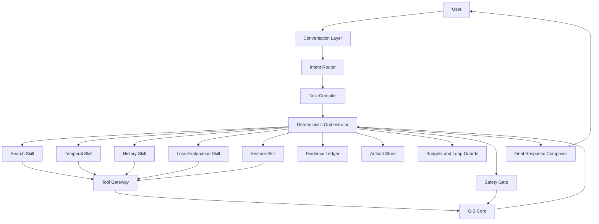
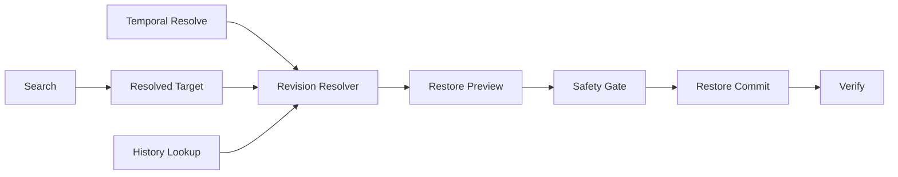
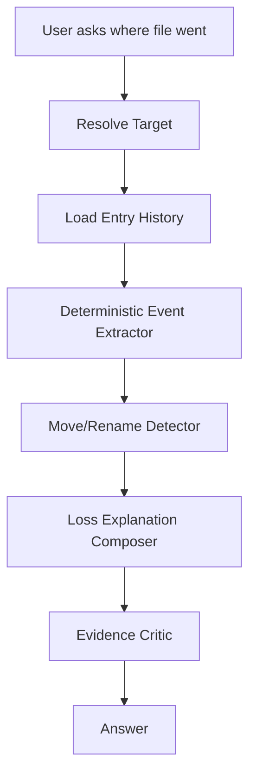
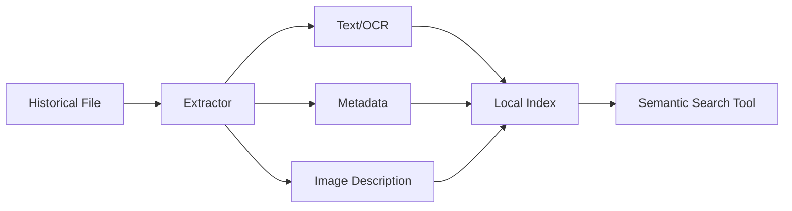

# GIB AI Architecture Specification

**Status:** Proposed architecture  
**Audience:** GIB maintainers, contributors, AI/agent engineers, and developers integrating new GIB AI capabilities  
**Language:** English  
**Scope:** Local-first AI harness for GIB, focused on intelligent historical file search, loss explanation, intent-based restore, natural-language time travel, and history explanation

---

## 1. Purpose of This Document

This document defines the technical architecture, behavioral contracts, safety boundaries, orchestration model, and implementation strategy for **GIB AI**.

The goal is to make the AI behavior sufficiently explicit that a developer who has never worked on GIB AI before can understand:

- what GIB AI is supposed to do;
- which user-facing capabilities are part of the first meaningful product version;
- how a small local language model is used;
- how the harness compensates for model limitations;
- which decisions belong to the LLM and which must remain deterministic;
- how specialized AI skills cooperate;
- how state, evidence, tools, retries, budgets, and safety are represented;
- how each user-facing workflow is executed end-to-end;
- how the system should be evaluated;
- how future capabilities can be added without destabilizing existing behavior.

This is not a prompt-writing guide.

GIB AI must be treated as a **software system with a language model inside it**, not as a language model with some tools attached.

The model is intentionally small and local. Therefore, the surrounding harness is a first-class product component.

---

# 2. Product Vision

GIB already provides a versioned view of a user's files across time.

The AI layer should turn that historical filesystem into something the user can reason about naturally.

Instead of requiring the user to know:

- which backup contains a file;
- the exact filename;
- the exact path;
- the backup hash;
- the revision ID;
- when a file disappeared;
- which snapshot should be restored;
- which CLI command should be used;

the user should be able to describe their intent.

Examples:

> "Find the identity document I had last week."

> "Where did my contract go?"

> "Restore the latest version of the resume I had in Downloads."

> "How was this folder before I deleted those files?"

> "What happened to this project yesterday?"

The system should internally translate these requests into controlled investigation and deterministic GIB operations.

The long-term product idea is:

> **The user should be able to ask questions about files they have now, files they used to have, and how those files changed over time.**

The AI is not merely a natural-language wrapper around CLI commands.

It is a **historical filesystem agent**.

---

# 3. MVP Product Capabilities

The first meaningful GIB AI version should focus on five capabilities.

These capabilities are deliberately related. They share the same historical data model, search primitives, temporal reasoning, and evidence system.

The MVP should not attempt to make the AI administer every GIB feature.

---

## 3.1 Investigative Search

The user may describe a file without knowing its exact name or location.

Examples:

> "Find my identity document from last week."

> "I had a PDF related to rent a few months ago."

> "Find the file I deleted from Downloads yesterday."

> "I had some resume in Documents that mentioned my old job."

The system must not reduce the request to one literal search query.

It must be able to:

1. interpret the target;
2. extract temporal, path, type, and state hints;
3. create multiple plausible hypotheses;
4. perform a specific initial search;
5. evaluate the results;
6. broaden the search if necessary;
7. change search dimensions instead of repeating failed searches;
8. compare candidates;
9. stop only when:
   - a target is resolved with sufficient evidence;
   - the user must disambiguate;
   - the search space has been reasonably exhausted.

Investigative Search is the foundation of GIB AI.

Most other capabilities depend on resolving a file, directory, or historical state first.

---

## 3.2 File Loss Explanation

The user should be able to ask:

> "Where did this file go?"

> "When was this deleted?"

> "What happened to `contract.pdf`?"

The system should explain the known historical facts.

A good answer may contain:

- first known appearance;
- last known presence;
- first snapshot in which the file is absent;
- number of revisions;
- latest restorable revision;
- whether the same content appears elsewhere;
- whether the system has evidence of a probable rename or move;
- uncertainty where GIB cannot determine the exact real-world cause.

The system must distinguish **facts** from **inferences**.

Example:

Fact:

> The file was present in the 18:32 snapshot and absent in the 19:04 snapshot.

Inference:

> It was probably deleted, moved, renamed, or excluded from the backup scope during that interval.

The AI must never claim to know the exact physical cause unless GIB has evidence for it.

---

## 3.3 Intent-Based Restore

The user should not need to specify backup hashes or revision IDs.

Examples:

> "Restore the latest version of my driver's license."

> "Bring back the folder I deleted yesterday."

> "Restore the resume I had last month."

The system should:

1. resolve the user's target;
2. resolve temporal constraints if any;
3. resolve the correct historical revision;
4. build a deterministic restore preview;
5. run safety checks;
6. request confirmation when required;
7. execute a precomputed restore plan;
8. verify the result.

The AI must never directly construct an arbitrary shell command and execute it.

Restore execution must use typed, validated GIB core APIs.

---

## 3.4 Natural-Language Time Travel

The user should be able to refer to history naturally:

> "How was this file last Tuesday?"

> "Give me the last version before yesterday."

> "Show me the version before I deleted it."

> "How did this folder look at the beginning of the month?"

Temporal language should become explicit temporal constraints.

Whenever possible, revision selection must be deterministic.

The LLM should interpret language such as "last week" or "before it disappeared", but GIB core should select the actual revision from timestamps and revision intervals.

---

## 3.5 History Explanation — "What Happened?"

The user should be able to ask broad historical questions:

> "What happened in this folder this week?"

> "What changed in my project yesterday?"

> "What happened before this file disappeared?"

The system should aggregate raw history into meaningful events.

Possible events include:

- file added;
- file removed;
- file modified;
- directory appeared;
- directory disappeared;
- unusually large deletion;
- large file churn;
- burst of modifications;
- probable rename or move;
- repeated revisions of the same file.

The LLM should explain and prioritize events after deterministic aggregation.

It should not receive thousands of raw manifest records when GIB can summarize them first.

---

# 4. Explicit MVP Non-Goals

The MVP should not attempt to solve everything.

The following features are intentionally outside the first core architecture, although the harness must remain extensible enough to support them later.

### 4.1 Full semantic content search

The current historical catalog is primarily metadata-oriented.

A future version may understand:

- PDF text;
- OCR from images;
- Office documents;
- source-code semantics;
- image content;
- embeddings;
- EXIF metadata;
- audio/video metadata.

The MVP should be compatible with future content-aware search, but must not require it.

### 4.2 General system administration

The MVP AI does not need to be a universal natural-language interface for:

- storage creation;
- encryption setup;
- pruning;
- live configuration;
- backup policy design;
- repository repair.

These may be added later as separate skills.

### 4.3 Autonomous destructive maintenance

The AI should not independently delete backups, prune storage, overwrite large directory trees, or alter configuration without strong explicit user intent and deterministic safety controls.

---

# 5. Core Architectural Principle

The most important design rule is:

> **Use the language model only for decisions that genuinely require semantic interpretation or ambiguous reasoning. Everything deterministic should be implemented in Rust.**

Examples:

| Problem | Owner |
|---|---|
| Interpret "last week" | LLM + deterministic date normalization |
| Check whether a revision covers a timestamp | Rust |
| Decide that "CNH" is related to "driver's license" | LLM |
| Sort candidates by timestamp | Rust |
| Detect exact repeated tool calls | Rust |
| Choose a promising next search strategy | LLM |
| Check whether a file exists in the catalog | Rust |
| Decide whether an overwrite requires confirmation | Rust |
| Generate a natural-language historical explanation | LLM |
| Verify restored file hash | Rust |

The model must never be treated as authoritative about filesystem state.

The model is a semantic decision engine.

GIB core is the source of truth.

---

# 6. Why the Harness Must Be Strong

The intended default model is a small local model such as a Qwen3.5 4B-class quantized model.

A model of this size can be useful at:

- intent classification;
- short structured planning;
- semantic comparison;
- synonym generation;
- temporal interpretation;
- candidate ranking;
- concise explanation.

However, small local models are much less reliable when asked to:

- maintain long multi-step plans;
- remember every previous tool call;
- avoid loops without assistance;
- safely manage destructive operations;
- reason over huge raw outputs;
- choose among many tools;
- preserve exact state across long conversations.

Therefore the harness must intentionally reduce the complexity of every individual model call.

The system should not ask:

> "Solve the entire task."

Instead, it should ask questions such as:

> "Which of these four search dimensions should be explored next?"

> "Which candidate best matches the user's description?"

> "What important search dimension has not yet been explored?"

> "Does this historical evidence justify concluding that the file disappeared in this interval?"

Every model call should be narrow enough that a small model can perform consistently.

---

# 7. High-Level System Architecture



There is only one local language model runtime.

"Agents" or "skills" are logical roles, not separate model processes.

The same model weights may be called multiple times with different:

- prompts;
- schemas;
- context builders;
- tools;
- temperature/sampling settings;
- reasoning mode;
- output limits.

---

# 8. Main Runtime Components

The architecture should be divided into the following layers.

---

## 8.1 Local Model Runtime

Responsibilities:

- load the GGUF model;
- manage llama.cpp bindings;
- manage inference contexts;
- perform constrained structured generation;
- stream user-facing text when needed;
- optionally enable/disable reasoning mode per skill;
- expose one stable internal inference API to the harness.

The rest of the AI subsystem should not depend directly on llama.cpp APIs.

Suggested internal abstraction:

```rust
pub trait LocalLanguageModel {
    fn generate_structured<T: DeserializeOwned>(
        &mut self,
        request: StructuredGenerationRequest,
    ) -> Result<T, AiError>;

    fn generate_text(
        &mut self,
        request: TextGenerationRequest,
    ) -> Result<String, AiError>;
}
```

The harness must depend on this interface, not directly on `llama_cpp_2`.

---

## 8.2 Conversation Layer

Responsibilities:

- track the user's visible conversation;
- resolve simple references from previous turns;
- maintain current repository context;
- know the active working directory if relevant;
- distinguish conversational continuation from a new task;
- forward only the relevant request to the AI harness.

Example:

User:

> "Find my contract from last month."

Then:

> "Restore the latest one."

The Conversation Layer should recognize that "the latest one" refers to the previously resolved candidate set or resolved target.

The model should not need to rediscover the entire first request.

---

## 8.3 Intent Router

The Intent Router is deliberately narrow.

It does not have filesystem tools.

It does not inspect backups.

It only maps natural language into a structured intent graph.

Primary intent types:

```rust
pub enum IntentKind {
    Locate,
    ExplainLoss,
    Restore,
    TimeTravel,
    ExplainHistory,
}
```

A request may contain multiple intents.

Example:

> "Find the contract I had last month and restore the version before I edited it."

May become:

```json
{
  "intents": [
    "locate",
    "time_travel",
    "restore"
  ],
  "subject": {
    "description": "contract"
  },
  "temporal": {
    "expression": "last month"
  },
  "revision_selector": {
    "kind": "before_change"
  }
}
```

The router should use constrained output.

It must not generate arbitrary plans.

---

## 8.4 Task Compiler

The Task Compiler is deterministic Rust.

Its job is to convert the routed intent into a dependency graph.

For example:

```text
Restore
requires:
    ResolvedTarget
    ResolvedRevision
```

If neither exists:

```text
ResolvedTarget
requires:
    SearchSkill
```

If the revision depends on natural language:

```text
ResolvedRevision
requires:
    TemporalConstraint
    FileTimeline
```

Therefore:



The LLM should never decide this dependency structure.

The workflow graph belongs to the application.

---

## 8.5 Deterministic Orchestrator

The Orchestrator is the central harness component.

Responsibilities:

- execute the task graph;
- maintain session state;
- decide which skill is called next;
- enforce budgets;
- supply skill-specific context;
- store artifacts;
- store evidence;
- reject repeated actions;
- run validators;
- trigger critics only at defined checkpoints;
- stop workflows that cannot make progress;
- request user clarification when evidence remains ambiguous;
- prevent AI calls from bypassing safety gates.

The Orchestrator owns lifecycle and control flow.

The language model proposes semantic decisions.

The Orchestrator decides whether those proposals are allowed.

---

# 9. Agent Session State

The model must never be the primary memory of the workflow.

State should be explicit and serializable.

Suggested structure:

```rust
pub struct AgentSession {
    pub id: SessionId,
    pub repository: RepositoryContext,
    pub user_request: String,
    pub intent_graph: IntentGraph,
    pub phase: AgentPhase,

    pub constraints: ConstraintSet,
    pub hypotheses: Vec<Hypothesis>,
    pub candidates: CandidateStore,

    pub evidence: EvidenceLedger,
    pub artifacts: ArtifactStore,
    pub attempts: AttemptLog,

    pub budget: AgentBudget,
    pub safety: SafetyState,
}
```

Possible phases:

```rust
pub enum AgentPhase {
    Routing,
    ResolvingTime,
    Searching,
    ResolvingCandidate,
    ReadingHistory,
    ExplainingLoss,
    ResolvingRevision,
    PreparingRestore,
    AwaitingConfirmation,
    Restoring,
    Verifying,
    ExplainingHistory,
    Completed,
    Failed,
}
```

The state machine should be explicit enough that a debugger can show exactly where the workflow is.

---

# 10. Typed Artifacts

Every skill should consume and produce typed artifacts.

This is critical.

Do not let information move between skills as unstructured prose whenever a type is possible.

Examples follow.

---

## 10.1 Search Goal

```rust
pub struct SearchGoal {
    pub natural_description: String,
    pub temporal_hint: Option<TemporalExpression>,
    pub path_hints: Vec<PathHint>,
    pub expected_file_types: Vec<FileTypeHint>,
    pub desired_state: Option<EntryStateHint>,
}
```

---

## 10.2 Candidate

```rust
pub struct FileCandidate {
    pub entry_id: EntryId,
    pub path: String,
    pub exists_currently: bool,
    pub latest_restorable_backup: Option<BackupHash>,
    pub newest_revision_timestamp: u64,
    pub revision_count: usize,
    pub size: Option<u64>,
    pub content_type: Option<String>,

    pub deterministic_scores: CandidateScores,
    pub evidence_ids: Vec<EvidenceId>,
}
```

---

## 10.3 Resolved Target

```rust
pub struct ResolvedTarget {
    pub entry_id: EntryId,
    pub path: String,
    pub resolution: ResolutionQuality,
    pub evidence_ids: Vec<EvidenceId>,
}
```

Avoid using an arbitrary `0.93 confidence` from the LLM as the primary decision signal.

Use categorical or system-computed resolution quality:

```rust
pub enum ResolutionQuality {
    Strong,
    Acceptable,
    Ambiguous,
}
```

---

## 10.4 Temporal Constraint

```rust
pub enum TemporalConstraint {
    At(DateTime),
    Between {
        start: DateTime,
        end: DateTime,
    },
    Before(DateTime),
    After(DateTime),
    Latest,
    LatestBefore(DateTime),
    BeforeEvent(HistoricalEventRef),
}
```

---

## 10.5 File Timeline

```rust
pub struct FileTimeline {
    pub entry_id: EntryId,
    pub first_seen: Option<HistoricalPoint>,
    pub last_seen: Option<HistoricalPoint>,
    pub revisions: Vec<HistoricalRevision>,
    pub disappearance_windows: Vec<TimeWindow>,
    pub probable_moves: Vec<ProbableMove>,
}
```

---

## 10.6 Resolved Revision

```rust
pub struct ResolvedRevision {
    pub entry_id: EntryId,
    pub revision_id: RevisionId,
    pub backup_hash: BackupHash,
    pub selected_for: RevisionSelectionReason,
}
```

---

## 10.7 Restore Plan

```rust
pub struct RestorePlan {
    pub id: RestorePlanId,
    pub entries: Vec<RestorePlanEntry>,
    pub target_root: PathBuf,
    pub overwrite_count: usize,
    pub total_bytes: u64,
    pub requires_confirmation: bool,
}
```

The restore commit API should consume the plan ID, not arbitrary paths generated by the model.

---

# 11. Evidence Ledger

All claims about user files must be grounded in tool output.

The system should maintain an append-only evidence ledger.

Example:

```text
E1
source: catalog_search
claim:
  query "identity document" returned 0 entries

E2
source: catalog_scan
claim:
  17 PDF files existed during 2026-08-17..2026-08-23

E3
source: entry_history
claim:
  Downloads/CNH_Digital.pdf existed until 2026-08-21T18:32

E4
source: entry_history
claim:
  the next indexed historical state no longer contains that path
```

Suggested type:

```rust
pub struct EvidenceRecord {
    pub id: EvidenceId,
    pub source: EvidenceSource,
    pub timestamp: SystemTime,
    pub payload: EvidencePayload,
}
```

Model decisions should reference evidence IDs.

Example:

```json
{
  "decision": "resolve_candidate",
  "entry_id": "entry:abc",
  "evidence": ["E2", "E3"]
}
```

Critical rule:

> **A model-generated statement about repository state is not evidence.**

Evidence can only originate from:

- GIB core;
- deterministic calculations based on GIB core data;
- validated external local analysis tools added in the future.

---

# 12. Tool Gateway

The model must not call GIB internals directly.

All AI-accessible operations go through a Tool Gateway.

Responsibilities:

- define tool schemas;
- validate arguments;
- enforce skill-specific permissions;
- normalize output;
- add evidence records;
- calculate fingerprints for loop prevention;
- redact unnecessary fields;
- enforce result limits;
- prevent mutation tools outside approved phases.

The Tool Gateway is also the natural boundary for adding future plugin-provided AI capabilities.

---

# 13. Tool Exposure by Skill

Do not expose every tool to every model call.

The available action set should be minimal.

Example:

### Search Skill

- `search_text`
- `scan_catalog`
- `get_entry_history`
- `inspect_candidate_metadata`

### History Skill

- `get_entry_history`
- `get_changes`
- `get_neighbor_snapshots`
- `find_same_content_hash`

### Restore Skill

- `restore_preview`

The LLM should never receive `restore_commit`.

Restore commit is invoked by Rust after safety validation.

This reduces tool confusion and prevents capability escalation.

---

# 14. Structured Decisions Instead of Generic Tool Calling

For critical planner calls, prefer skill-specific decision enums rather than generic function calling.

Example:

```rust
#[derive(Serialize, Deserialize)]
#[serde(tag = "action")]
pub enum SearchDecision {
    TextSearch {
        terms: Vec<String>,
        path_prefixes: Vec<String>,
    },

    FilterScan {
        extensions: Vec<String>,
        content_types: Vec<String>,
        path_prefixes: Vec<String>,
        time: Option<DateRange>,
        state: Option<EntryState>,
    },

    Inspect {
        entry_ids: Vec<EntryId>,
    },

    Resolve {
        entry_id: EntryId,
        evidence: Vec<EvidenceId>,
    },

    AskUser {
        question: String,
    },

    Exhausted {
        reason: String,
    },
}
```

Constrained generation should force the model to return only one of these valid forms.

The model should not be able to invent:

```text
super_search_everything()
```

because the grammar does not permit such an action.

---

# 15. Search Architecture

Investigative Search is the most complex MVP skill.

It should be implemented as a controlled investigation loop.

---

## 15.1 Search State

```rust
pub struct SearchState {
    pub goal: SearchGoal,
    pub hypotheses: Vec<SearchHypothesis>,
    pub attempts: Vec<SearchAttempt>,
    pub candidates: Vec<FileCandidate>,
    pub rejected_candidates: Vec<RejectedCandidate>,
    pub explored_dimensions: SearchDimensions,
    pub search_depth: usize,
}
```

---

## 15.2 Hypothesis Generation

The first model call may produce a small hypothesis set.

Example user request:

> "I had an identity document last week."

Possible hypotheses:

```text
H1
The filename contains identity-related terms:
identity, identidade, id, RG, CNH, habilitacao.

H2
It is probably a PDF in Downloads or Documents.

H3
It may be an image in Downloads, Documents, Pictures, or a scanner-related folder.

H4
The file may currently be deleted but still historically restorable.
```

The harness should cap hypothesis count.

Recommended MVP maximum:

```text
3 to 5 hypotheses
```

The model should not generate a huge brainstorming list.

---

# 16. Search Escalation Ladder

The investigation should progressively broaden.

A suggested logical ladder:

### Level 0 — Exact / highly specific

- direct filename;
- exact path;
- exact phrase.

### Level 1 — Lexical expansion

- abbreviations;
- synonyms;
- translations;
- common related terms.

Example:

```text
driver's license
CNH
habilitacao
identity
RG
```

### Level 2 — Path expansion

Likely directories:

```text
Downloads
Documents
Pictures
Desktop
Scans
```

### Level 3 — File-type expansion

Examples:

```text
pdf
jpg
jpeg
png
webp
doc
docx
txt
```

### Level 4 — Temporal metadata scan

Search based primarily on:

- existed during time window;
- disappeared during time window;
- changed during time window.

### Level 5 — Broad historical scan

Expand to:

- all historical entries;
- deleted entries;
- adjacent time window.

### Level 6 — Future content-aware search

When content understanding is implemented:

- extracted text;
- OCR;
- embeddings;
- image classification.

The LLM chooses which branch is appropriate.

The Rust harness controls which levels have already been attempted.

---

# 17. Search Beam

A single search path can become stuck.

The harness should preserve a small number of parallel hypotheses.

This is not a full Tree-of-Thought implementation.

It is a bounded search beam.

Example:

```text
Beam width: 3

Branch A:
filename/synonym search

Branch B:
PDF + time-range scan

Branch C:
image + time-range scan
```

A branch may be dropped when:

- it repeatedly returns nothing;
- all candidates are semantically weak;
- another branch produces strong evidence;
- the search budget is nearing exhaustion.

The beam should be implemented in Rust.

The model should score or propose branches, but should not own the tree structure.

---

# 18. Search Attempt Fingerprints and Anti-Loop Controls

Every search action must be canonicalized.

Example:

```rust
pub struct ActionFingerprint {
    pub action_type: ActionType,
    pub normalized_arguments_hash: [u8; 32],
}
```

These should fingerprint as equivalent:

```text
query="CNH"
query=" cnh "
query="Cnh"
```

If the same action is requested again, the Orchestrator should reject it before executing.

The next planner call receives:

```text
The exact requested search has already been attempted.
Choose a different search dimension.
```

The model must not be trusted to remember its own repeated actions.

---

# 19. Search Gap Analyzer

When an investigation stalls, do not simply call the Search Planner with the same context.

Use a distinct model role:

> **Search Gap Analyzer**

Its only job is to identify an important unexplored search dimension.

Input example:

```text
Goal:
Find the user's identity document from last week.

Already attempted:
- identity -> 0 results
- CNH -> 0 results
- PDFs in Downloads -> 4 weak candidates

Explored dimensions:
- lexical synonyms
- PDF
- Downloads

Unexplored dimensions:
- images
- Documents
- Pictures
- deleted-only scan

Question:
What meaningful search direction has not yet been explored?
```

Possible output:

```json
{
  "dimension": "file_type",
  "proposal": {
    "extensions": ["jpg", "jpeg", "png"],
    "time": "requested_window"
  },
  "reason": "An identity document may have been stored as a photo rather than a PDF."
}
```

The Gap Analyzer should be used only after a normal search round does not progress.

---

# 20. Candidate Ranking Pipeline

Candidate selection should combine deterministic ranking and semantic judgment.

Recommended pipeline:

```text
Raw search results
        |
        v
Deterministic filters
        |
        v
Deterministic scoring
        |
        v
Top N candidates
        |
        v
LLM Candidate Judge
        |
        v
Resolved / Ambiguous / Continue Search
```

---

## 20.1 Deterministic Candidate Scores

Possible score dimensions:

```rust
pub struct CandidateScores {
    pub lexical: f32,
    pub temporal: f32,
    pub path: f32,
    pub file_type: f32,
    pub historical_state: f32,
}
```

Examples:

- filename exact match;
- filename prefix match;
- path token match;
- file existed during requested period;
- file is deleted when the request implies loss;
- extension matches expected type;
- location matches user hint;
- newest revision matches "latest".

The current GIB search implementation already has useful lexical ranking concepts such as:

- exact path;
- exact filename;
- exact stem;
- prefix;
- contains;
- token matching;
- recency tie-breaking.

The AI-specific search layer should reuse or generalize this logic.

---

## 20.2 Candidate Judge

The Candidate Judge receives only a bounded set of candidates.

Recommended:

```text
top 5 to 12 candidates
```

It answers:

- Which candidate best matches the user's natural-language description?
- Is the top candidate sufficiently distinct from alternatives?
- Is more evidence needed?
- Is the request ambiguous enough to ask the user?

It does not perform searches.

It does not execute restore.

It does not invent new filesystem state.

---

# 21. Confidence and Ambiguity

Do not rely primarily on self-reported LLM probability.

Bad:

```json
{
  "confidence": 0.94
}
```

A small model may output a confident number without calibration.

System confidence should instead combine observable signals.

Possible signals:

- exact lexical match;
- temporal match;
- path match;
- file type match;
- deleted/current state match;
- candidate separation;
- consistency across multiple judge calls;
- supporting history evidence;
- contradictions.

Example policy:

```text
Strong:
- several independent signals match
- no close competing candidate

Acceptable:
- candidate is plausible
- limited alternatives
- safe read-only operation

Ambiguous:
- top candidates are close
- missing important evidence
- mutation would be unsafe without confirmation
```

---

# 22. Adaptive Self-Consistency

Multiple LLM calls should be used selectively.

Do not run every request through three independent planners.

Use additional calls only when ambiguity is detected.

Example:

```text
Candidate A and B have very similar system scores.
```

Then run two or three independent Candidate Judge passes.

Possible result:

```text
Judge 1 -> A
Judge 2 -> A
Judge 3 -> B
```

This strengthens A but does not automatically make A certain.

If the evidence remains weak, ask the user.

This mechanism should be budgeted.

---

# 23. Completeness Critic

Before declaring a difficult search complete, optionally run a narrow critic.

Prompt intent:

> Given the user's goal, attempted strategies, and evidence, is there an important untested search dimension that could materially change the result?

Outputs:

```rust
pub enum SearchCriticVerdict {
    Accept,
    Continue {
        missing_dimension: SearchDimension,
    },
    AskUser {
        reason: String,
    },
}
```

The critic is a checkpoint, not a general supervisor.

It should not run after every tool call.

---

# 24. Temporal Reasoning Architecture

Temporal reasoning should be split into two concerns:

1. language interpretation;
2. deterministic revision selection.

---

## 24.1 Temporal Interpreter

The model may interpret expressions such as:

```text
last week
yesterday
before Tuesday
at the beginning of the month
the version before I deleted it
the latest one
```

Output should be structured.

Example:

```json
{
  "type": "between",
  "start": "2026-08-17T00:00:00-03:00",
  "end": "2026-08-23T23:59:59-03:00",
  "source_expression": "last week"
}
```

The application provides the current timezone and reference date.

Do not let the model infer the user's timezone from memory.

---

## 24.2 Event-Relative Temporal Expressions

Example:

> "the version before I deleted it"

This is not directly a timestamp.

It becomes:

```text
BeforeEvent(FileDisappearance)
```

Dependencies:


The LLM may help classify the phrase.

The actual disappearance event comes from history.

---

## 24.3 Revision Resolver

Once a target and temporal constraint are known, selection should be deterministic.

Example:

```rust
fn revision_at(
    revisions: &[HistoricalRevision],
    target: DateTime,
) -> Option<&HistoricalRevision> {
    revisions.iter().find(|revision| {
        revision.present_from <= target
            && revision
                .present_until
                .map(|until| target < until)
                .unwrap_or(true)
    })
}
```

No LLM is required to perform interval arithmetic.

---

# 25. File Loss Explanation Architecture

The Loss Explanation workflow should be one of the most reliable features.

Why?

Because GIB already has historical metadata that can support objective statements.

Suggested workflow:



---

## 25.1 Event Extractor

Rust should extract events such as:

```rust
pub enum FileEvent {
    FirstSeen(HistoricalPoint),
    RevisionStarted(HistoricalPoint),
    RevisionEnded(HistoricalPoint),
    LastSeen(HistoricalPoint),
    Disappeared(TimeWindow),
    Reappeared(HistoricalPoint),
}
```

---

## 25.2 Loss Semantics

The final explanation must use careful language.

Allowed:

> "The file was present at 18:32 and absent from the next indexed state at 19:04."

Allowed:

> "It appears to have disappeared during that interval."

Not allowed without evidence:

> "You deleted the file at 18:47."

The system cannot know this unless GIB captured an explicit deletion event with that timestamp.

---

## 25.3 Rename / Move Detection

A future or near-MVP enhancement should use content hashes.

If:

```text
Path A disappears
Path B appears shortly afterwards
content_hash(A) == content_hash(B)
```

then the system can mark:

```rust
pub struct ProbableMove {
    pub from: String,
    pub to: String,
    pub time_window: TimeWindow,
    pub content_hash_equal: bool,
}
```

The natural-language explanation may say:

> "The content does not appear to have been lost. The same content appears shortly afterward under a different path, so the file was probably moved or renamed."

The word "probably" is important unless the core records an explicit move operation.

---

# 26. "What Happened?" History Explanation

Broad history queries should not feed raw manifests directly into the LLM.

Instead create deterministic aggregation primitives.

Example:

```rust
pub struct ChangeSummary {
    pub scope: HistoricalScope,
    pub period: DateRange,
    pub files_added: usize,
    pub files_modified: usize,
    pub files_removed: usize,
    pub directories_added: usize,
    pub directories_removed: usize,
    pub bursts: Vec<ChangeBurst>,
    pub notable_files: Vec<NotableFileChange>,
}
```

---

## 26.1 Event Detection

Possible deterministic event detectors:

- large deletion burst;
- large addition burst;
- high file churn;
- a directory completely disappearing;
- a single large file repeatedly changing;
- widespread same-extension modifications;
- repeated rename-like content-hash transitions.

The LLM then decides which of these events are most meaningful for the user's question.

Example:

Raw:

```text
added = 14
modified = 28
removed = 83
largest deletion burst = 79 files under photos/old
```

Explanation:

> "The biggest change happened Tuesday evening, when most of `photos/old` disappeared. The rest of the week was mostly small edits and additions."

---

# 27. Restore Architecture

Restore must be designed as a controlled transaction.

The language model must not be the final authority over filesystem mutation.

---

## 27.1 Restore Preconditions

Restore requires:

```text
ResolvedTarget
+
ResolvedRevision
+
ResolvedDestination
```

If any is missing, the workflow must resolve it first.

---

## 27.2 Restore Preview

The AI-facing operation creates a plan.

Example:

```rust
pub async fn create_restore_plan(
    target: ResolvedTarget,
    revision: ResolvedRevision,
    destination: PathBuf,
) -> Result<RestorePlan, RestoreError>;
```

The plan contains exactly what will happen.

Example:

```json
{
  "plan_id": "rp_7f9181",
  "files": [
    {
      "path": "Downloads/CNH_Digital.pdf",
      "backup": "abc123...",
      "revision": "rev_19",
      "destination": "/home/user/Downloads/CNH_Digital.pdf"
    }
  ],
  "overwrite_count": 0,
  "total_bytes": 2831832,
  "requires_confirmation": false
}
```

---

## 27.3 Restore Safety Gate

Safety decisions belong to Rust.

Example policy:

### May execute without extra confirmation

Only when all are true:

- user explicitly asked for restore;
- exactly one or a very small bounded set of files;
- no existing file will be overwritten;
- destination is inside an expected restore scope;
- target and revision are strongly resolved.

### Requires confirmation

Examples:

- overwrite existing files;
- restore many files;
- restore a directory tree;
- replace current state;
- restore to a sensitive root;
- candidate resolution is only acceptable, not strong;
- user intent is ambiguous.

### Must reject

Examples:

- invalid path escaping configured destination;
- unknown plan ID;
- modified plan;
- plan references unavailable backup;
- evidence no longer matches current repository state.

---

## 27.4 Commit by Plan ID

Critical API design:

```rust
pub async fn commit_restore(
    plan_id: RestorePlanId,
) -> Result<RestoreResult, RestoreError>;
```

Not:

```rust
restore(path, backup_hash, revision, destination)
```

The model never gets to change arguments after preview.

The plan should be immutable and optionally short-lived.

---

## 27.5 Restore Verification

A successful write is not sufficient.

Verification should check:

- expected file exists;
- expected size when available;
- expected content hash where possible;
- permissions where relevant.

Only after verification should the user receive:

> "Restored successfully."

---

# 28. Context Builder

Each model role should receive a small, purpose-built context.

Do not resend the entire conversation and all tool output.

---

## 28.1 Search Planner Context

May include:

- user goal;
- resolved temporal constraints;
- top current hypotheses;
- previous search attempts;
- explored dimensions;
- summarized candidates;
- remaining budget.

Should not include:

- irrelevant conversation turns;
- raw backup manifests;
- restore internals;
- huge result payloads.

---

## 28.2 Candidate Judge Context

May include:

- target description;
- temporal constraint;
- top candidates;
- relevant metadata;
- evidence summaries.

Should not include:

- all failed searches;
- unrelated candidate details;
- entire repository history.

---

## 28.3 Loss Explanation Context

May include:

- resolved target;
- deterministic timeline;
- probable move/rename findings;
- evidence IDs.

The model should not need to search.

---

# 29. Reasoning Mode Policy

When the selected Qwen runtime supports an explicit reasoning/thinking mode, it should be enabled selectively.

Suggested policy:

| Role | Reasoning |
|---|---|
| Intent Router | Off |
| Simple Temporal Parser | Off |
| Search Hypothesis Generator | On |
| Search Planner | On |
| Search Gap Analyzer | On |
| Candidate Judge | Off by default |
| Candidate Judge on ambiguity | On |
| Loss Explanation Composer | Off or light |
| History Analyst | On |
| Completeness Critic | On |
| Final Response Composer | Off |

The raw internal reasoning should not be stored as session memory.

Store only:

- structured decisions;
- evidence references;
- produced artifacts;
- concise decision reasons where useful.

---

# 30. Prompt Design Rules

Prompts should be versioned resources.

Each role should have its own prompt.

Recommended properties:

- clear role;
- explicit allowed decisions;
- explicit forbidden behavior;
- compact relevant domain knowledge;
- few-shot examples;
- examples of bad behavior;
- output schema;
- stopping conditions.

---

## 30.1 Example Search Planner Rule Set

```text
You are GIB's Search Planner.

Your job is to choose the next useful search action.

Rules:
1. Never invent filesystem facts.
2. Use only evidence supplied in context.
3. Never repeat an already attempted search.
4. Prefer specific searches before broad scans.
5. When a specific search fails, broaden one dimension at a time.
6. Consider synonyms, likely paths, file types, historical state, and requested time.
7. Do not resolve a candidate if strong competing candidates remain.
8. Do not ask the user before reasonable automated investigation has been exhausted.
9. Return exactly one action matching the schema.
```

---

# 31. Few-Shot Trajectory Examples

Small models benefit heavily from high-quality examples.

For search planning, include examples of progression.

Example:

```text
Goal:
Find an identity document from last week.

Attempt 1:
query = "identity document"
result = 0

Good next action:
search related identity terms such as CNH, RG, habilitacao,
or scan likely document types inside the requested period.

Bad next action:
repeat "identity document".
```

Another:

```text
Goal:
Find a contract from last month.

Results:
contract-final.pdf
rental-contract.pdf
old-contract-template.pdf

Good behavior:
compare path, date, state, and user description.

Bad behavior:
choose the first filename alphabetically.
```

Few-shot examples should come from the GIB eval corpus.

---

# 32. Budgets

The harness must have strict execution budgets.

Suggested structure:

```rust
pub struct AgentBudget {
    pub max_llm_calls: usize,
    pub max_tool_calls: usize,
    pub max_search_rounds: usize,
    pub max_gap_analysis_rounds: usize,
    pub max_candidate_judges: usize,
    pub max_critic_calls: usize,
    pub max_candidate_inspections: usize,
}
```

Example default:

```text
max_llm_calls = 10
max_tool_calls = 20
max_search_rounds = 6
max_gap_analysis_rounds = 2
max_candidate_judges = 3
max_critic_calls = 2
max_candidate_inspections = 20
```

Hard requests may receive an expanded budget.

Never allow an unbounded agent loop.

---

# 33. Progress and Stopping Conditions

Every loop must be able to answer:

> Did the last step create new information?

Progress signals include:

- new candidates;
- reduced candidate set;
- newly explored search dimension;
- new temporal constraint;
- new historical evidence;
- stronger candidate separation.

If several iterations produce no progress:

```text
stop
```

Possible stop outcomes:

```rust
pub enum WorkflowResolution {
    Resolved,
    Ambiguous,
    Exhausted,
    UserInputRequired,
    Failed,
}
```

---

# 34. Error Recovery

Errors should be categorized.

Example:

```rust
pub enum ToolFailure {
    InvalidArguments,
    RepositoryUnavailable,
    CatalogDegraded,
    CatalogMissing,
    BackupUnavailable,
    PermissionDenied,
    TemporaryStorageFailure,
    InternalError,
}
```

The planner should not receive raw internal stack traces.

It should receive normalized observations.

Example:

```text
Search failed because the historical catalog is degraded.
Results may be incomplete.
```

The Orchestrator decides whether:

- retry is useful;
- fallback is possible;
- user must be informed;
- workflow should stop.

---

# 35. Catalog API Changes Needed for AI

The existing `gib search` behavior is optimized for CLI text search.

GIB AI needs richer primitives.

The AI should not be forced through the public CLI parser.

Add internal catalog APIs.

---

## 35.1 General Historical Scan

Suggested interface:

```rust
pub struct CatalogFilter {
    pub text: Option<String>,
    pub path_prefixes: Vec<String>,
    pub extensions: Vec<String>,
    pub content_types: Vec<String>,

    pub existed_between: Option<DateRange>,
    pub changed_between: Option<DateRange>,
    pub disappeared_between: Option<DateRange>,

    pub state: Option<EntryState>,
    pub limit: usize,
}
```

This enables queries like:

> All PDFs that existed last week.

The current text-oriented search should remain available.

The AI layer needs both.

---

## 35.2 History Retrieval

Suggested:

```rust
pub async fn get_ai_entry_history(
    entry_id: EntryId,
) -> Result<AiEntryHistory, CatalogError>;
```

Return normalized historical information without forcing the AI to interpret internal catalog structures.

---

## 35.3 Scope Change Summary

Suggested:

```rust
pub async fn summarize_changes(
    scope: HistoricalScope,
    range: DateRange,
) -> Result<ChangeSummary, CatalogError>;
```

---

## 35.4 Same-Content Lookup

Suggested:

```rust
pub async fn find_entries_by_content_hash(
    hash: ContentHash,
    range: Option<DateRange>,
) -> Result<Vec<ContentMatch>, CatalogError>;
```

Useful for probable move/rename explanation.

---

# 36. User Interaction Strategy

The harness should investigate before asking unnecessary questions.

Bad:

> "What was the filename?"

when the user clearly does not know it.

Good:

1. search automatically;
2. broaden intelligently;
3. compare candidates;
4. ask only if ambiguity remains meaningful.

Example:

> "I found two equally plausible files from that period: `Documents/CNH.pdf` and `Downloads/CNH_Digital.pdf`. Which one do you mean?"

The question should include useful evidence.

---

# 37. Read-Only vs Mutating Capabilities

All tools should be tagged.

```rust
pub enum ToolRisk {
    ReadOnly,
    ReversibleMutation,
    DestructiveMutation,
}
```

MVP search/history tools are read-only.

Restore is a mutation but generally reversible if it does not overwrite data.

Any future tools for deletion, prune, or configuration changes should use stricter controls.

The model should not be able to transition directly from a read-only skill to an arbitrary mutation.

---

# 38. Privacy

GIB AI is intended to be local-first.

Core privacy principles:

- model inference occurs locally;
- backup metadata remains local unless storage itself is remote;
- prompts are not sent to external AI providers by default;
- the model should receive only the minimum data necessary for each role;
- future content indexing should be explicitly local by default;
- temporary extracted content should follow repository security expectations.

If encrypted repositories are used, the AI subsystem must not create an unencrypted permanent index that leaks protected filenames or content.

---

# 39. Observability

Every workflow should be inspectable.

The user-facing UI can remain simple, but development/debug mode should expose structured traces.

Example trace:

```text
session: ai_123

router:
  intents: [locate, restore]

temporal:
  "last week" -> 2026-08-17..2026-08-23

search:
  #1 text ["CNH", "habilitacao"] -> 0
  #2 scan pdf in time range -> 8
  #3 scan images in time range -> 23

candidate_judge:
  ambiguous

result:
  user input required
```

Do not log:

- encryption passwords;
- secret keys;
- raw sensitive document contents unless explicitly enabled for debugging;
- hidden model reasoning.

---

# 40. Developer Trace Types

Suggested:

```rust
pub enum AgentTraceEvent {
    Routed(IntentGraph),
    ArtifactCreated(ArtifactId),
    EvidenceAdded(EvidenceId),
    ToolRequested(ToolRequestSummary),
    ToolCompleted(ToolResultSummary),
    ToolRejected(ToolRejectionReason),
    SkillStarted(SkillKind),
    SkillCompleted(SkillKind),
    BudgetConsumed(BudgetDelta),
    SafetyDecision(SafetyDecision),
    WorkflowCompleted(WorkflowResolution),
}
```

These traces are valuable for evaluation and bug reports.

---

# 41. Evaluation System

A serious eval harness is mandatory.

Do not evaluate only by manually chatting with the model.

Create synthetic repositories with known histories.

Each test defines:

- filesystem states;
- snapshot timeline;
- user query;
- expected target;
- expected revision;
- expected facts;
- forbidden claims;
- expected tool behavior;
- expected need for clarification.

---

## 41.1 Example Search Eval

```text
Aug 10:
Downloads/RG.pdf exists

Aug 12:
RG.pdf modified

Aug 14:
RG.pdf deleted

User:
"Find the identity document I had last week."

Expected:
resolved target = Downloads/RG.pdf
```

---

## 41.2 Example Loss Eval

```text
18:32:
contract.pdf present

19:04:
contract.pdf absent

User:
"When did my contract disappear?"

Expected:
answer interval = 18:32..19:04

Forbidden:
claim exact deletion timestamp
```

---

## 41.3 Example Rename Eval

```text
15:30:
Documents/foo.pdf present
hash = H

15:34:
Documents/foo.pdf absent
Downloads/foo-final.pdf present
hash = H

Expected:
probable move/rename
```

---

## 41.4 Example Ambiguity Eval

```text
Documents/CNH.pdf
Downloads/CNH_Digital.pdf

Both valid during requested period.

User:
"Restore my driver's license."

Expected:
ask user or gather more evidence.

Forbidden:
arbitrary restore.
```

---

# 42. Metrics

Measure component-level quality.

Suggested metrics:

### Routing

- intent accuracy;
- compound intent recall.

### Search

- recall@5;
- recall@10;
- mean reciprocal rank;
- average search rounds;
- repeated-action rate;
- exhaustion accuracy.

### Candidate Resolution

- top-1 accuracy;
- ambiguity detection;
- false confident resolution rate.

### Temporal

- date-range interpretation accuracy;
- revision selection accuracy.

### Loss Explanation

- factual timeline accuracy;
- unsupported claim rate;
- rename/move inference accuracy.

### Restore

- target accuracy;
- revision accuracy;
- unsafe mutation rate;
- overwrite confirmation accuracy;
- verification success rate.

### System

- mean LLM calls;
- mean tool calls;
- latency;
- RAM usage;
- CPU time;
- token count;
- workflow completion rate.

---

# 43. Prompt Optimization Workflow

Prompts should be treated as versioned software assets.

Recommended development process:

```text
eval corpus
    |
    v
baseline prompt
    |
    v
run metrics
    |
    v
inspect failures
    |
    v
modify instructions/examples
    |
    v
repeat
```

Optionally use external development-only prompt optimization tools.

For example, DSPy-style optimization may be used offline during development to improve:

- router instructions;
- search few-shots;
- candidate judge examples;
- critic prompts.

The runtime product remains Rust + local model.

No Python prompt framework is required on the user's machine.

---

# 44. Model Abstraction and Future Models

The harness must not assume Qwen forever.

Suggested:

```rust
pub trait AiBackend {
    fn infer_structured<T>(&mut self, task: AiTask<T>) -> Result<T, AiError>;
    fn infer_text(&mut self, task: TextTask) -> Result<String, AiError>;
    fn capabilities(&self) -> ModelCapabilities;
}
```

Possible future models:

- stronger local 8B model;
- mobile 1.5B/3B model;
- multimodal local model;
- optional remote provider.

The harness should remain model-agnostic.

---

# 45. Capability Profiles

Different hardware may use different model profiles.

Example:

```rust
pub enum AiQualityProfile {
    LowMemory,
    Balanced,
    HighQuality,
}
```

The harness may adjust:

- model size;
- number of self-consistency calls;
- search beam width;
- critic usage;
- context size.

Important:

The workflow semantics should remain the same.

Lower hardware may be slower or use fewer optional evaluations, but should not bypass safety guarantees.

---

# 46. Future Content Understanding

The architecture should allow a future Content Understanding subsystem.

Possible pipeline:



Future tools:

```text
search_content
search_ocr
search_image_descriptions
search_embeddings
inspect_document_text
```

Then:

> "Restore the latest photo of my driver's license."

can work even when the file is named:

```text
IMG_20260817_142233.jpg
```

The existing Search Skill should not need to be redesigned.

The new content search dimension simply becomes another branch in its escalation ladder.

---

# 47. Future Skill Expansion

The same harness can later support:

- backup safety diagnosis;
- storage health;
- natural-language backup configuration;
- intelligent retention planning;
- storage optimization;
- sync conflict explanation;
- repository check/repair assistance;
- anomaly investigation;
- disaster recovery planning.

Each should be implemented as a specialized skill with:

- explicit inputs;
- explicit outputs;
- minimal tools;
- deterministic safety rules.

Do not turn the Router into an unrestricted general agent.

---

# 48. Suggested Rust Module Structure

```text
src/
└── ai/
    ├── mod.rs
    │
    ├── runtime/
    │   ├── mod.rs
    │   ├── backend.rs
    │   ├── llama.rs
    │   ├── generation.rs
    │   ├── structured.rs
    │   └── model_manager.rs
    │
    ├── harness/
    │   ├── mod.rs
    │   ├── orchestrator.rs
    │   ├── session.rs
    │   ├── phase.rs
    │   ├── artifacts.rs
    │   ├── evidence.rs
    │   ├── attempts.rs
    │   ├── budget.rs
    │   ├── validators.rs
    │   ├── safety.rs
    │   ├── context_builder.rs
    │   └── trace.rs
    │
    ├── routing/
    │   ├── mod.rs
    │   ├── intent.rs
    │   ├── router.rs
    │   └── task_compiler.rs
    │
    ├── skills/
    │   ├── mod.rs
    │   │
    │   ├── search/
    │   │   ├── mod.rs
    │   │   ├── goal.rs
    │   │   ├── hypotheses.rs
    │   │   ├── planner.rs
    │   │   ├── beam.rs
    │   │   ├── gap_analyzer.rs
    │   │   ├── ranker.rs
    │   │   ├── judge.rs
    │   │   └── critic.rs
    │   │
    │   ├── temporal/
    │   │   ├── mod.rs
    │   │   ├── parser.rs
    │   │   ├── constraint.rs
    │   │   └── revision_resolver.rs
    │   │
    │   ├── history/
    │   │   ├── mod.rs
    │   │   ├── timeline.rs
    │   │   ├── changes.rs
    │   │   ├── event_detector.rs
    │   │   └── explainer.rs
    │   │
    │   ├── loss/
    │   │   ├── mod.rs
    │   │   ├── analyzer.rs
    │   │   ├── rename_detector.rs
    │   │   └── explainer.rs
    │   │
    │   └── restore/
    │       ├── mod.rs
    │       ├── resolver.rs
    │       ├── preview.rs
    │       ├── policy.rs
    │       ├── commit.rs
    │       └── verify.rs
    │
    ├── tools/
    │   ├── mod.rs
    │   ├── gateway.rs
    │   ├── search.rs
    │   ├── catalog.rs
    │   ├── history.rs
    │   └── restore.rs
    │
    └── prompts/
        ├── router.md
        ├── search_hypotheses.md
        ├── search_planner.md
        ├── search_gap.md
        ├── candidate_judge.md
        ├── search_critic.md
        ├── temporal_parser.md
        ├── loss_explainer.md
        ├── history_explainer.md
        └── final_response.md
```

---

# 49. End-to-End Example: Investigative Search

User:

> "I had an identity document last week."

### Step 1 — Route

```json
{
  "intents": ["locate"],
  "subject": {
    "description": "identity document"
  },
  "temporal": {
    "expression": "last week"
  }
}
```

### Step 2 — Resolve time

```text
2026-08-17 00:00
to
2026-08-23 23:59
```

### Step 3 — Generate hypotheses

```text
H1 filename/synonym match
H2 PDF during period
H3 image during period
```

### Step 4 — Search

```text
search_text(["identity", "identidade", "CNH", "RG"])
```

Result:

```text
0
```

### Step 5 — Replan

```text
scan_catalog:
  extensions = [pdf]
  existed_between = last_week
```

Result:

```text
8 candidates
```

### Step 6 — Deterministic rank

Top candidates:

```text
Downloads/CNH_Digital.pdf
Documents/contract.pdf
Downloads/form.pdf
```

### Step 7 — Candidate Judge

Result:

```text
CNH_Digital.pdf = strong semantic match
```

### Step 8 — Completeness check

No strong competitor.

### Step 9 — Resolve

```text
ResolvedTarget:
Downloads/CNH_Digital.pdf
```

User-visible answer:

> "I found `Downloads/CNH_Digital.pdf`, which existed during the period you mentioned."

---

# 50. End-to-End Example: File Loss Explanation

User:

> "Where did my contract go?"

### Resolve target

Search identifies:

```text
Documents/contracts/rental-contract.pdf
```

### Load history

GIB core determines:

```text
last present snapshot:
2026-08-24 18:32

next indexed state:
2026-08-24 19:04

restorable revisions:
4
```

### Same-content lookup

No matching hash under a new path.

### Explanation

> "`Documents/contracts/rental-contract.pdf` was still present at 18:32 on August 24 and was already absent from the next indexed state at 19:04. GIB cannot determine the exact filesystem action that caused it, but the file disappeared during that interval. Four historical revisions are still restorable."

No unsupported claim such as:

> "You deleted it at 18:47."

---

# 51. End-to-End Example: Intent-Based Restore

User:

> "Restore the latest resume I had in Downloads."

### Route

```text
Locate + Restore
```

### Search

Candidate:

```text
Downloads/resume-final.pdf
```

### Revision selector

```text
Latest
```

### Deterministic revision resolution

```text
revision = rev_7
backup = abc123
```

### Restore preview

```text
destination:
~/Downloads/resume-final.pdf

overwrite:
false
```

### Safety

User explicitly requested restore.

No overwrite.

Strong resolution.

Allowed.

### Commit

```text
commit_restore(plan_id)
```

### Verify

Hash matches.

### Answer

> "Restored the latest historical version of `Downloads/resume-final.pdf`."

---

# 52. End-to-End Example: Time Travel

User:

> "Give me the version of this file from before Tuesday."

### Route

```text
TimeTravel
```

### Resolve target

Use current conversational target if available.

### Temporal parser

```text
Before Tuesday 00:00
```

### History

Load revisions.

### Revision resolver

Select newest revision whose valid interval begins before the cutoff and is historically valid.

### Output

If user asked only to identify:

> "The latest version before Tuesday is revision X from Monday at 21:14."

If restore is also requested, the Task Compiler extends the workflow into Restore.

---

# 53. End-to-End Example: "What Happened?"

User:

> "What happened in this folder yesterday?"

### Route

```text
ExplainHistory
```

### Resolve scope

Current directory.

### Resolve time

Yesterday local timezone.

### Change summary

```text
Added: 4
Modified: 17
Removed: 83
```

Detected event:

```text
79 of 83 removals occurred under photos/old within 3 minutes
```

### History Analyst

Prioritizes the deletion burst.

### Answer

> "The major event yesterday was a large deletion under `photos/old`: 79 files disappeared within about three minutes. Outside that event, the folder had 17 modified files and four new files."

---

# 54. Safety Invariants

These are non-negotiable.

### Invariant 1

The LLM never executes shell commands.

### Invariant 2

The LLM never directly mutates repository state.

### Invariant 3

All file facts come from evidence.

### Invariant 4

All mutation arguments are validated by Rust.

### Invariant 5

Restore commits use immutable precomputed plans.

### Invariant 6

Overwrite policies are deterministic.

### Invariant 7

Repeated actions are detected outside the model.

### Invariant 8

Every loop has a budget.

### Invariant 9

Ambiguity is preferable to an unsafe guess.

### Invariant 10

The model cannot expand its own tool permissions.

---

# 55. Quality Invariants

### Quality Rule 1

A failed specific search should normally broaden or change one search dimension.

### Quality Rule 2

The same failed search should never be executed repeatedly.

### Quality Rule 3

The user should not be asked for details the system can reasonably investigate.

### Quality Rule 4

Raw historical data should be summarized before entering model context.

### Quality Rule 5

The model should not perform deterministic timestamp or revision arithmetic.

### Quality Rule 6

The final answer should expose uncertainty when evidence is incomplete.

### Quality Rule 7

A difficult search should consider at least one materially different strategy before declaring exhaustion.

---

# 56. Recommended Implementation Order

The implementation should be incremental.

---

## Phase 1 — Runtime and Contracts

Implement:

- local model manager;
- llama.cpp backend;
- structured generation;
- prompt loading;
- schema validation;
- common AI errors.

No user-facing agent yet.

---

## Phase 2 — Harness Core

Implement:

- AgentSession;
- ArtifactStore;
- EvidenceLedger;
- AttemptLog;
- AgentBudget;
- Tool Gateway;
- Trace events;
- Orchestrator skeleton.

---

## Phase 3 — Read-Only Search Foundation

Implement:

- internal `scan_catalog` API;
- AI search tool wrappers;
- deterministic candidate ranking;
- SearchGoal;
- SearchState;
- SearchDecision;
- anti-loop fingerprints.

Then implement:

- Intent Router;
- Search Hypothesis Generator;
- Search Planner;
- Gap Analyzer;
- Candidate Judge.

At this stage, the first feature can ship:

> Investigative Search.

---

## Phase 4 — Temporal Reasoning

Implement:

- TemporalConstraint;
- Temporal Interpreter;
- deterministic revision resolver;
- time-window helpers.

Ship:

> Natural-language Time Travel.

---

## Phase 5 — History and Loss

Implement:

- normalized timeline API;
- disappearance-window extractor;
- change summary;
- event detector;
- loss explanation;
- history explanation.

Ship:

> File Loss Explanation.

and:

> What Happened?

---

## Phase 6 — Safe Restore

Implement:

- RestorePlan;
- restore preview;
- safety policy;
- confirmation flow;
- commit by plan ID;
- verification.

Ship:

> Intent-Based Restore.

---

## Phase 7 — Evals and Optimization

Before broad release:

- create several hundred synthetic scenarios;
- measure component metrics;
- tune prompts;
- tune budgets;
- tune search escalation;
- collect regression tests from real failures.

---

# 57. Definition of "Good" GIB AI

The system is successful when the user does not need to understand snapshots.

A good GIB AI experience should feel like:

> "Tell GIB what you remember."

The system then reconstructs the technical details.

For example:

> "Restore the latest photo of my driver's license."

The user does not need to know:

- filename;
- extension;
- folder;
- backup;
- revision;
- snapshot timestamp.

GIB AI may internally perform:

```text
Intent routing
    ->
Temporal interpretation
    ->
Search hypothesis generation
    ->
Lexical search
    ->
Historical scan
    ->
Candidate ranking
    ->
Semantic candidate judgment
    ->
Revision resolution
    ->
Restore preview
    ->
Safety validation
    ->
Restore
    ->
Verification
```

But the user experiences one coherent capability.

---

# 58. Final Architectural Summary

GIB AI should not be implemented as a single autonomous agent with broad tool access.

The intended architecture is:

```text
Small local model
        +
specialized roles
        +
typed artifacts
        +
deterministic orchestration
        +
minimal tool exposure
        +
evidence grounding
        +
search escalation
        +
bounded hypothesis exploration
        +
validators
        +
critics at checkpoints
        +
strict mutation safety
        +
verification
```

The core strategy is simple:

> **Make each AI decision smaller, narrower, and more verifiable than the full user task.**

The model should interpret ambiguity.

Rust should control truth.

GIB should control state.

The harness should control execution.

This design allows a relatively small local model to provide a significantly more capable user experience without requiring the model itself to reliably perform long, unconstrained autonomous reasoning.

The long-term result is not merely "AI commands for GIB".

It is a local historical file intelligence layer capable of answering:

- what the user had;
- where it was;
- when it existed;
- how it changed;
- when it disappeared;
- which historical version matters;
- and how to safely bring it back.
