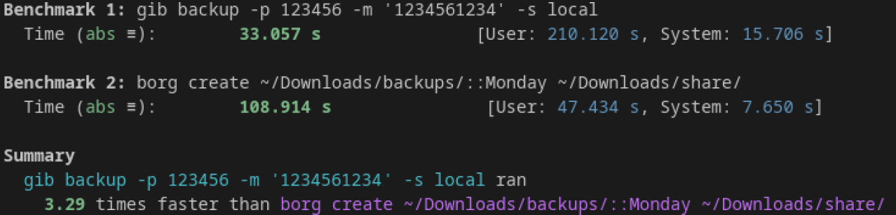

<h1 align="center">GIB</h1>

<p align="center">
  <strong>⚡ A blazingly fast, modern backup tool with versioning, deduplication, and encryption.</strong>
</p>

<p align="center">
  <a href="#-installation">Installation</a> •
  <a href="#-features">Features</a> •
  <a href="#-quick-start">Quick Start</a> •
  <a href="#-benchmarks">Benchmarks</a> •
  <a href="#-commands">Commands</a> •
  <a href="#-why-gib">Why gib?</a>
</p>

---

## 🚀 Installation

### Linux & macOS

```bash
curl -fsSL https://raw.githubusercontent.com/Theryston/gib/main/install.sh | bash
```

### Windows (PowerShell)

```powershell
irm https://raw.githubusercontent.com/Theryston/gib/main/install.ps1 | iex
```

That's it! Run `gib --help` to get started.

---

## ✨ Features

### 🔄 Versioned Backups

Every backup creates a unique snapshot with its own hash. Travel back in time to any point — restore exactly what you need, when you need it.

### 📁 Multi-Folder Backup with Repository Keys

Organize your backups using **repository keys** — unique identifiers that group all backups from a specific context together. Each key acts as a separate backup repository:

```bash
# Backup your videos
gib backup --key "pc-videos"

# Backup your documents
gib backup --key "work-documents"

# Backup your code projects
gib backup --key "dev-projects"
```

All version history, deduplication, and metadata are **isolated per key**:

- `pc-videos` → All your video backups with their own deduplication
- `work-documents` → All document versions, completely separate
- `dev-projects` → Your code history, independent from the rest

This means you can backup **multiple folders from different machines** to the same storage, each with its own timeline and without any interference. Perfect for:

- 🖥️ Backing up multiple computers to one S3 bucket
- 📂 Organizing backups by project or category
- 👥 Sharing storage between team members with separate keys

If no key is specified during backup, it will be the name of the folder where you ran `gib backup`.

### 🧩 Chunk-Level Deduplication

gib doesn't just deduplicate files — it deduplicates at the **chunk level**. This means:

- Only the **bytes that actually changed** are stored
- Modify 1KB in a 1GB file? Only ~1KB is uploaded
- Save up to **90%+ storage** compared to traditional backups

### 📦 Built-in Compression

All data is automatically compressed using **Zstd** (Zstandard) — one of the fastest and most efficient compression algorithms available. Configurable compression levels let you balance speed vs. size.

### 🔐 Military-Grade Encryption

Protect your backups with **ChaCha20-Poly1305** encryption and **Argon2** key derivation:

- Your password never leaves your machine
- Even if someone accesses your storage, they can't read your data
- Encrypt any backup

### ☁️ Direct Cloud Upload (Zero Disk Overhead)

Upload directly to **S3-compatible storage** without writing temporary files:

- No need for 2x disk space
- Stream chunks directly to the cloud
- Works with AWS S3, MinIO, Backblaze B2, Cloudflare R2, and more

### 💾 Local & Remote Storage

Choose where your backups live:

- **Local**: Any folder on your filesystem (support smb:// folders)
- **S3**: Any S3-compatible object storage

### 🔒 File Permissions Preserved

gib stores and restores **Unix file permissions** (and handles Windows gracefully), so your executables stay executable and your read-only files stay protected.

### ⚡ Parallel & Async

Built with **Tokio** for maximum performance:

- Concurrent chunk uploads/downloads
- Non-blocking I/O operations
- Progress bars that actually move

### 🧹 Smart Cleanup

- **Delete backups** and automatically remove orphaned chunks
- **Prune** unused chunks to reclaim storage space
- Reference counting ensures nothing important is deleted

---

## 🎯 Quick Start

### 1. Configure your identity

```bash
gib config --author "Your Name <you@example.com>"
```

### 2. Add a storage

**Local storage:**

```bash
gib storage add --name mybackups --type local --path /path/to/backups
```

**S3 storage:**

```bash
gib storage add --name cloud \
  --type s3 \
  --region us-east-1 \
  --bucket my-backup-bucket \
  --access-key YOUR_ACCESS_KEY \
  --secret-key YOUR_SECRET_KEY
```

### 3. Create your first backup

```bash
cd /path/to/your/project
gib backup --message "Initial backup"
```

### 4. View backup history

```bash
gib log
```

### 5. Restore a backup

```bash
gib restore

# it will list all the backups, and you can restore to any point
```

---

## ⚡ Benchmarks

**Real-world performance that speaks for itself.**

In real-world scenarios, `gib backup` consistently outperforms traditional backup tools. Our benchmarks show that in some cases, `gib backup` can be **up to 3.29x faster** than `borg create` — that's more than three times the speed! 🚀

### Performance Comparison

See the benchmark results comparing `gib backup` against `borg create`:



**What this means for you:**

- ⏱️ **Faster backups** = Less time waiting, more time working
- 💰 **Lower costs** = Less compute time on cloud storage
- ⚡ **Better experience** = Progress bars that actually move
- 🎯 **Real performance** = Built with Rust and Tokio for maximum efficiency

Don't just take our word for it — try it yourself and feel the speed difference!

---

## 📖 Commands

| Command              | Description                             |
| -------------------- | --------------------------------------- |
| `gib config`         | Configure your identity                 |
| `gib whoami`         | Show your current identity              |
| `gib backup`         | Create a new backup                     |
| `gib backup delete`  | Delete a backup and its orphaned chunks |
| `gib restore`        | Restore files from a backup             |
| `gib log`            | View backup history (paginated)         |
| `gib encrypt`        | Encrypt all chunks in a repository      |
| `gib storage add`    | Add a new storage location              |
| `gib storage list`   | List all configured storages            |
| `gib storage remove` | Remove a storage                        |
| `gib storage prune`  | Remove unused chunks                    |

### Backup Options

```bash
gib backup \
  --key my-project \           # Repository name (default: folder name)
  --message "My backup" \      # Backup description
  --storage cloud \            # Which storage to use
  --password "secret" \        # Enable encryption
  --compress 3 \               # Compression level (1-22, default: 3)
  --chunk-size "10 MB" \       # Chunk size (default: 5 MB)
  --root-path ./src            # Subdirectory to backup
```

### Restore Options

```bash
gib restore \
  --key my-project \           # Repository name
  --backup abc12345 \          # Backup hash (full or first 8 chars)
  --storage cloud \            # Which storage to use
  --password "secret" \        # Decrypt password
  --target-path ./restored     # Where to restore (default: current dir)
```

---

## 💡 Why gib?

### vs. Traditional Backup Tools

| Feature       | gib            | rsync | tar     |
| ------------- | -------------- | ----- | ------- |
| Versioning    | ✅             | ❌    | ❌      |
| Deduplication | ✅ Chunk-level | ❌    | ❌      |
| Compression   | ✅ Zstd        | ❌    | ✅ gzip |
| Encryption    | ✅ ChaCha20    | ❌    | ❌      |
| Cloud Storage | ✅ Native      | ❌    | ❌      |
| Incremental   | ✅ Automatic   | ✅    | ❌      |

### vs. Cloud Backup Services

| Feature     | gib                     | Cloud Services           |
| ----------- | ----------------------- | ------------------------ |
| Cost        | 💰 Pay only for storage | 💸 Monthly subscription  |
| Privacy     | 🔒 You hold the keys    | 🔓 Provider has access   |
| Flexibility | ✅ Any S3 storage       | ❌ Vendor lock-in        |
| Speed       | ⚡ Direct upload        | 🐌 Through their servers |
| Open Source | ✅ Yes                  | ❌ No                    |

### The Deduplication Advantage

Imagine you have a 1GB video file. You make a small edit (add a watermark) and save it.

**Traditional backup:**

- Upload: 1GB (entire file again)
- Storage used: 2GB total

**gib backup:**

- Upload: ~5-10MB (only changed chunks)
- Storage used: ~1.01GB total

That's **99% less upload time** and **50% less storage** for a single edit!

---

## 🛡️ Security

gib uses industry-standard cryptography:

- **ChaCha20-Poly1305**: A modern AEAD cipher, faster than AES on devices without hardware acceleration
- **Argon2**: Winner of the Password Hashing Competition, resistant to GPU/ASIC attacks
- **SHA-256**: For content-addressable storage and integrity verification

Your password is used to derive an encryption key locally. The password itself is never stored or transmitted.

---

## 🏗️ How It Works

```text
+-------------------------------+
|         Your Files            |
+-------------------------------+
               |
               v
+-------------------------------+
|     Split into Chunks         |
| (configurable, default 5MB)   |
+-------------------------------+
               |
               v
+-------------------------------+
|    SHA-256 Hash Each Chunk    |
|  (content-addressable store)  |
+-------------------------------+
               |
               v
+-------------------------------+
|  Skip Existing Chunks         |
|  (deduplication)              |
+-------------------------------+
               |
               v
+-------------------------------+
|   Compress with Zstd          |
+-------------------------------+
               |
               v
+-------------------------------+
| Encrypt with ChaCha20         |
|    (if password set)          |
+-------------------------------+
               |
               v
+-------------------------------+
| Upload to Storage (Local/S3)  |
| (streamed, no temp files)     |
+-------------------------------+
```

---

## 📊 Storage Structure

```
repository-key/
├── backups/
│   ├── <backup-hash-1>
│   ├── <backup-hash-2>
│   └── ...
├── chunks/
│   ├── aa/
│   │   ├── bb1234...
│   │   └── cc5678...
│   ├── bb/
│   │   └── ...
│   └── ...
└── indexes/
    ├── backups     # List of all backups
    └── chunks      # Reference counts for deduplication
```

---

## 🤝 Contributing

Contributions are welcome! Feel free to:

- 🐛 Report bugs
- 💡 Suggest features
- 🔧 Submit pull requests

---

## 📄 License

MIT License - see [LICENSE](LICENSE) for details.

---

<p align="center">
  <strong>Made with ❤️ and Rust 🦀</strong>
</p>

<p align="center">
  <sub>Stop losing your data. Start using gib.</sub>
</p>
