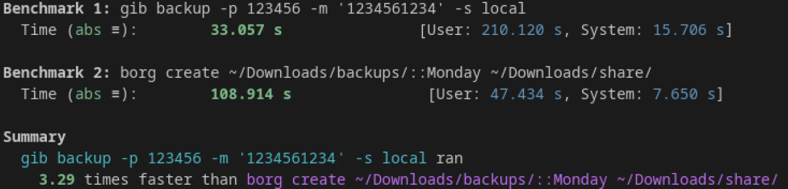

<h1 align="center">GIB</h1>

<p align="center">
  <strong>⚡ Back up your files. Keep them in sync. Travel through their history.</strong>
</p>

<p align="center">
  GIB is a fast, open-source backup and synchronization tool that turns your storage into a
  <strong>versioned filesystem shared across your computers</strong>.
</p>

<p align="center">
  <a href="#-quick-start">Quick Start</a> •
  <a href="#-why-gib">Why GIB?</a> •
  <a href="#-installation">Installation</a> •
  <a href="#-live-backup--sync">Live</a> •
  <a href="#-explore-your-files-through-time">Explore</a> •
  <a href="#-commands">Commands</a> •
  <a href="#-benchmarks">Benchmarks</a>
</p>

---

## ⚡ Quick Start

From install to your first restore in about a minute.

### 1. Install GIB

**Linux & macOS**

```bash
curl -fsSL https://trygib.org/unix.sh | bash
```

**Windows (PowerShell)**

```powershell
irm https://trygib.org/win.ps1 | iex
```

### 2. Configure your identity

```bash
gib config --author "Your Name <you@example.com>"
```

### 3. Create a local storage

From the folder you want to back up, create a storage directory next to it:

```bash
mkdir ../gib-backups
gib storage add --name quickstart --type local --path ../gib-backups
```

### 4. Create your first backup

```bash
gib backup --storage quickstart --message "First backup"
```

### 5. Restore it

```bash
gib restore --storage quickstart --backup latest --target-path ../gib-restore
```

That's it — you created a versioned backup and restored it.

Want S3/WebDAV, `gib.toml`, Live sync, encryption and the full setup flow?
**[Continue with the Detailed Setup Guide](#-detailed-setup-guide).**

---

## 💡 Why GIB?

Most tools make you choose between two different jobs:

```text
Backup tool
    +
Sync tool
```

GIB brings them together.

```text
                   GIB
                    │
          ┌─────────┼─────────┐
          │         │         │
          ▼         ▼         ▼
       Backup      Sync     History
          │         │         │
      Snapshots    Live     Explore
          │         │         │
       Dedupe    Conflicts   Search
          │         │         │
      Encryption  Merging  Deleted files
```

Create normal point-in-time backups when you want them.

Or run:

```bash
gib live
```

and let GIB continuously:

- detect local changes;
- create incremental versioned snapshots;
- synchronize changes between active computers;
- receive remote changes even when nothing changed locally;
- merge compatible text edits when two computers changed the same project;
- detect conflicts instead of silently overwriting data;
- preserve the history behind every synchronization.

And when you need something back, don't think in terms of backup archives.

Just explore your filesystem through time:

```bash
gib explore
```

Find a file you deleted weeks ago.

Search for something without knowing which backup contained it.

Open its revision history.

Select files from completely different points in time.

Restore them together.

**Snapshots are an implementation detail. Your files are what matter.**

---

## ✨ What Makes GIB Different?

### 🔄 Live Backup + Multi-Device Sync

Run GIB on one computer:

```bash
gib live
```

and every relevant batch of filesystem changes becomes a normal, restorable GIB
snapshot.

Run it on multiple computers using the same repository and GIB also keeps those
active workspaces synchronized.

```text
Laptop
  │
  │ gib live
  ▼
┌─────────────────┐
│ GIB Repository  │
└─────────────────┘
  ▲
  │ gib live
  │
Desktop
```

A change made on one device can be received by another while both retain the
version history behind it.

GIB compares each device's synchronized base with the current repository state
before publishing new changes. One-sided remote changes are applied
automatically.

When both sides changed the same content:

- compatible text changes can be merged using a bounded three-way merge;
- overlapping text edits are reported as conflicts;
- binary conflicts are reported instead of silently overwriting either side.

GIB is not just periodically copying a folder.

It is using a **versioned backup repository as the synchronization layer**.

---

### 🧭 Explore Your Files Through Time

Backups normally make you answer questions like:

> Which snapshot contained this file?

GIB tries to remove that problem entirely.

Run:

```bash
gib explore
```

to open an interactive terminal file explorer over your restorable history.

Conceptually:

```text
Repository: my-project · All history · 3 selected

▾ src                              current
  ▾ components                     current
      player.tsx                   current
      old-player.tsx               deleted
▾ config                           current
    old-production.json            deleted
    app.toml                       current
```

From the explorer you can:

- navigate folders;
- see current and deleted files;
- search historical paths;
- inspect file revisions;
- select individual files or whole directories;
- restore deleted files;
- restore an explicit historical revision;
- select files whose newest restorable versions belong to different backups;
- restore the entire selection in one operation.

GIB resolves the necessary snapshots internally.

You select files.

GIB figures out where they came from.

---

### 🔎 Search Files You No Longer Have

Can't remember when a file existed?

You don't need to.

```bash
gib search invoice
```

GIB maintains a repository-resident historical catalog that lets it search known
paths without downloading file contents or scanning every old backup manifest.

Search can find:

- files that exist today;
- files deleted from the latest snapshot;
- historical paths that still have a restorable revision.

Example:

```text
documents/taxes/invoice-2024.pdf
  last backup: a1c4d7e2
  restore: gib restore --backup a1c4d7e2 --only documents/taxes/invoice-2024.pdf
```

The catalog contains metadata, not file contents, and is updated incrementally
as new backups are finalized.

---

### 🗂️ A Historical Filesystem Catalog

Every new GIB snapshot can contribute to a metadata-only historical catalog
stored with the repository itself.

The catalog tracks information such as:

- known file paths;
- directory relationships;
- current/deleted state;
- restorable revisions;
- searchable name tokens;
- the newest available backup that can restore a file.

It is updated only for paths affected by new backups.

It does **not** need to rebuild your entire backup history after every snapshot.

It does **not** download file chunks to answer navigation or search queries.

And because the catalog belongs to the repository rather than one local machine,
another device can use the same history.

Backup manifests and chunks remain the authoritative source of data.

---

### 💻 Developer-Friendly Workspace Synchronization

GIB Live is especially useful for development workspaces.

It recursively detects Git repositories and deliberately does **not** treat
`.git` as one giant machine-local directory.

Shareable Git data such as:

- commit objects;
- pack files;
- refs;
- packed refs;

can be synchronized between devices.

Machine-local working state such as:

- `HEAD`;
- the staging index;
- locks;
- reflogs;
- hooks;
- temporary operation files;

is excluded from Live synchronization.

That means a commit created on one synchronized machine can become available on
another without treating every local Git implementation detail as shared state.

These rules apply specifically to `gib live`.

For normal backups, you control whether `.git` is included using your normal
ignore configuration.

---

### 🕒 Every Backup Is a Snapshot

GIB never turns Live synchronization into a separate proprietary state format.

The snapshots produced by Live are normal GIB backups.

That means they remain compatible with the same:

- history;
- restore;
- search;
- explore;
- encryption;
- deduplication;
- deletion;
- pruning;

used by manually created backups.

You can also create explicit snapshots whenever you want:

```bash
gib backup --message "Before production migration"
```

Every completed backup receives its own hash and can be restored independently.

---

### 🎯 Restore Exactly What You Need

You don't need to restore an entire repository.

Restore one file:

```bash
gib restore --backup latest --only src/config.ts
```

Restore a directory:

```bash
gib restore --backup latest --only documents/contracts
```

Or open the interactive selector:

```bash
gib restore --only
```

For more complex historical restores, use:

```bash
gib explore
```

---

### ♻️ Resume Interrupted Backups

Large backup interrupted halfway through?

GIB keeps enough pending state to continue rather than starting from zero.

```bash
gib backup --continue <backup-hash>
```

Already uploaded chunks are reused and only the remaining work needs to
complete.

List unfinished backups with:

```bash
gib backup pending
```

---

### 📁 Keep Multiple Repositories in the Same Storage

Repository keys isolate independent backup timelines inside one storage.

```bash
gib backup --key pc-videos
gib backup --key work-documents
gib backup --key dev-projects
```

Each key maintains its own:

- snapshots;
- history;
- deduplication metadata;
- catalog;
- repository state.

This makes it possible to use one storage destination for many projects, folders
or computers without mixing their timelines.

If no key is specified, GIB uses the current folder name by default.

---

## ⚙️ The Backup Engine Underneath It

The higher-level GIB experience is powered by a content-addressed backup engine.

### 🧩 Chunk-Level Deduplication

Files are split into chunks and stored by content hash.

When data already exists in the repository, GIB reuses it rather than uploading
another copy.

This is especially useful for:

- large files with partial changes;
- repeated project dependencies;
- frequently changing snapshots;
- Live synchronization;
- many versions of similar files.

---

### 📦 Zstd Compression

Backup data is compressed with **Zstandard (Zstd)** before storage.

Compression level is configurable so you can choose between faster processing
and smaller stored data.

---

### 🔐 Client-Side Encryption

Repositories can be protected using:

- **ChaCha20-Poly1305** for authenticated encryption;
- **Argon2** for password-based key derivation.

Repository passwords are used locally to derive encryption keys and are not
stored inside the repository.

Historical catalog data follows the repository's encryption and compression
pipeline as well, preventing encrypted repositories from leaking filenames
through an unencrypted search index.

---

### ☁️ Stream Directly to Storage

GIB can write directly to the configured backend without first producing a
temporary backup archive.

Supported storage types include:

- **Local filesystem**
- **S3-compatible object storage**
- **WebDAV**

Examples include:

- AWS S3;
- Cloudflare R2;
- Backblaze B2;
- MinIO;
- Nextcloud;
- ownCloud;
- Synology;
- QNAP.

No temporary second copy of the repository is required.

---

### 🔒 Preserve File Permissions

Unix file permissions are recorded and restored so executable and read-only
state survives a backup/restore cycle.

Windows is handled gracefully where Unix permission semantics do not directly
apply.

---

### ⚡ Parallel by Design

GIB is written in Rust and uses Tokio for asynchronous I/O.

Backup and restore operations can process multiple chunks concurrently,
including uploads and downloads to remote storage.

---

### 🧹 Clean Up Safely

Delete snapshots you no longer want:

```bash
gib backup delete
```

Reclaim unreferenced data:

```bash
gib storage prune
```

GIB tracks chunk references so data that remains necessary to surviving backups
is preserved.

---

## 🚀 Installation

### Linux & macOS

```bash
curl -fsSL https://trygib.org/unix.sh | bash
```

### Windows

```powershell
irm https://trygib.org/win.ps1 | iex
```

Then:

```bash
gib --help
```

---

# 📚 Detailed Setup Guide

## 1. Configure your identity

```bash
gib config --author "Your Name <you@example.com>"
```

---

## 2. Discover Existing Local GIB Storages

If you already have GIB repositories somewhere below the current directory:

```bash
gib setup
```

GIB searches for existing repository structures and registers detected local
storages.

Limit discovery to the immediate level:

```bash
gib setup --no-recursive
```

The current directory itself is also checked.

During recursive discovery, known dependency, build, cache and system
directories are pruned before unnecessary traversal.

Once a storage is recognized, its repository-key directories are not incorrectly
registered as separate storages.

This is particularly useful when moving an existing backup disk to a new
computer.

---

## 3. Add a Storage

### Local

```bash
gib storage add \
  --name mybackups \
  --type local \
  --path /path/to/backups
```

### S3

```bash
gib storage add \
  --name cloud \
  --type s3 \
  --region us-east-1 \
  --bucket my-backup-bucket \
  --access-key YOUR_ACCESS_KEY \
  --secret-key YOUR_SECRET_KEY
```

### WebDAV

```bash
gib storage add \
  --name home-cloud \
  --type webdav \
  --url https://cloud.example.com/remote.php/dav/files/user/gib-backups/ \
  --username user \
  --password YOUR_APP_PASSWORD
```

WebDAV uses Basic authentication with the configured username and password/app
password.

Prefer HTTPS whenever the connection is not otherwise protected.

GIB validates the configured collection before saving it and uses the remote
WebDAV collection directly — no local mount or temporary repository copy is
required.

For safe concurrent repository updates, the WebDAV server must provide usable
ETags and honor conditional writes.

---

## 4. Create Your First Backup

```bash
cd /path/to/your/project
gib backup --message "Initial backup"
```

You now have your first versioned snapshot.

---

## 5. Add Project Defaults with `gib.toml`

Put `gib.toml` in your project:

```toml
version = 1

[repository]
storage = "mybackups"
key = "my-project"

[backup]
root_path = "."
message = "Project backup"
compress = 3
chunk_size = "5 MB"
concurrency = 8
ignore = ["node_modules", "dist"]

[live]
message = "Project live synchronization"
debounce_ms = 1500
poll_ms = 2000

[restore]
target_path = "./.gib-restore"
```

Now repository commands can reuse that configuration:

```bash
gib backup
gib live
gib restore
gib log
gib search invoice
gib explore
```

GIB searches from the current directory upward and uses the nearest `gib.toml`.

Configuration precedence is:

```text
built-in defaults
        ↓
     gib.toml
        ↓
 explicit CLI flags
```

Ignore values from the config and repeated `--ignore` flags are combined.

Relative paths are resolved relative to the directory containing `gib.toml`.

Select another config explicitly:

```bash
gib backup --config /path/to/gib.toml
```

Or disable project configuration for one invocation:

```bash
gib backup --no-config
```

Secrets and destructive one-off options such as repository passwords and
`--prune-local` are intentionally not stored in `gib.toml`.

---

# 🔄 Live: Backup + Sync

Start continuous synchronization:

```bash
gib live
```

GIB performs an initial synchronization and then watches the configured root
recursively.

Filesystem changes are grouped into debounced batches.

Each meaningful batch produces an incremental snapshot.

Example Live snapshot message:

```text
[LIVE] created: 12 files; changed: 3 files
```

At the same time, GIB polls the repository for remote changes.

Run Live on another device using the same repository:

```text
Machine A                       Machine B
---------                       ---------
gib live                        gib live
    │                               │
    └──────── GIB repository ───────┘
```

Now both devices participate in the same synchronized, versioned filesystem.

### Conflict Handling

Before publishing local changes, GIB compares:

```text
local synchronized base
        │
        ├── local changes
        │
        └── remote repository HEAD
```

One-sided changes can be applied automatically.

Compatible text changes can be three-way merged.

Overlapping text changes and conflicting binary changes are surfaced instead of
silently replacing data.

In interactive mode you can choose how to resolve each conflict.

In JSON mode, provide an explicit policy:

```bash
gib live --conflict local
```

or:

```bash
gib live --conflict remote
```

### Git Repositories

Live recursively detects Git repositories inside the synchronized root.

Shareable repository data is synchronized, while machine-local working state is
excluded.

This allows Git history to move with the workspace without blindly synchronizing
every `.git` implementation detail.

---

# ⚙️ Start Live Automatically

You can turn a Live workspace into a persistent per-user background job.

```bash
gib autostart add \
  --name work-project \
  --root-path /path/to/work-project \
  --storage mybackups \
  --key work-project \
  --conflict local \
  --start-now
```

After login, GIB can automatically resume synchronization.

Platform integration is native:

```text
Linux    → systemd user service
macOS    → LaunchAgent
Windows  → Task Scheduler
```

Manage jobs with:

```bash
gib autostart list
gib autostart status work-project
gib autostart logs work-project
gib autostart disable work-project
gib autostart enable work-project
gib autostart update work-project --conflict remote
gib autostart remove work-project --yes
```

Autostart runs the same Live engine used by the foreground command.

Repository passwords are not placed in generated service command lines.

Where required, credentials are kept in the operating system credential store:

- Linux Secret Service;
- macOS Keychain;
- Windows Credential Manager.

Runtime logs are stored as bounded JSONL logs and can be followed using:

```bash
gib autostart logs work-project
```

or:

```bash
gib autostart log work-project
```

---

# 🕒 View Your Timeline

```bash
gib log
```

Each completed backup belongs to the repository's historical timeline.

Backup references accept:

- the full backup hash;
- a unique hash prefix;
- `latest`.

For example:

```bash
gib restore --backup latest
```

---

# 🎯 Restore a Snapshot

Interactive:

```bash
gib restore
```

GIB lets you choose the backup to restore.

Or specify one:

```bash
gib restore --backup a1c4d7e2
```

Restore only one path:

```bash
gib restore \
  --backup latest \
  --only src/config.ts
```

Open a tree selector:

```bash
gib restore --only
```

---

# 🔎 Search Historical Files

Search without knowing the snapshot:

```bash
gib search invoice
```

Combine terms:

```bash
gib search "tax 2021 pdf"
```

Restrict the search:

```bash
gib search "tax 2021 pdf" \
  --path downloads \
  --extension pdf
```

Limit results:

```bash
gib search invoice --limit 25
```

Search is case-insensitive.

Multiple terms must match the same logical path.

Results can include deleted paths when GIB still has a restorable historical
revision for them.

GIB ranks stronger name matches before broader partial matches.

Existing repositories that predate the historical catalog remain fully usable
for normal backup/restore operations. New snapshots populate the catalog
automatically.

---

# 🧭 Explore Your Files Through Time

Open the interactive historical filesystem:

```bash
gib explore
```

Useful actions include:

```text
↑ ↓      Navigate
← →      Collapse / expand
Space    Select
/        Search
H        File history
M        Current / All history
G        Jump to path
N        Load next page
R        Restore
?        Help
```

Browse only a subtree:

```bash
gib explore --path downloads
```

Include deleted historical paths:

```bash
gib explore --scope all-history
```

A file can have multiple restorable revisions.

Open its history and restore an older version directly.

Selections remain useful even when the selected files belong to different
snapshots: GIB resolves each selected file to the requested/restorable revision,
groups the work by backup internally and runs the normal restore pipeline.

Restoring through Explore is additive and does not silently prune unrelated
local files.

---

# 🤖 GIB as a CLI API

GIB is designed for humans **and** automation.

Commands support a global structured mode:

```bash
gib --mode json ...
```

For example:

```bash
gib --mode json log
gib --mode json search invoice
gib --mode json explore --path downloads
```

Live also emits structured lifecycle, synchronization, progress, conflict and
error events.

That makes the same CLI suitable as an engine for:

- shell automation;
- scripts;
- monitoring;
- desktop applications;
- editor integrations;
- dashboards;
- other interfaces built on top of GIB.

Interactive terminal behavior is never started when JSON mode requests a
non-interactive operation.

### Explore in JSON Mode

Browse:

```bash
gib explore \
  --mode json \
  --path downloads \
  --scope current
```

Search:

```bash
gib explore \
  --mode json \
  --query invoice
```

Inspect history:

```bash
gib explore \
  --mode json \
  --path downloads/installers/old.exe \
  --history
```

Restore explicit paths:

```bash
gib explore \
  --mode json \
  --restore \
  --select downloads/report.pdf \
  --select downloads/archive \
  --revision downloads/report.pdf=latest \
  --target-path ./restored
```

---

# 📖 Commands

| Command              | Description                                         |
| -------------------- | --------------------------------------------------- |
| `gib config`         | Configure your identity                             |
| `gib whoami`         | Show your current identity                          |
| `gib setup`          | Discover existing local GIB storages                |
| `gib backup`         | Create a versioned snapshot                         |
| `gib live`           | Continuously back up and synchronize active devices |
| `gib autostart`      | Manage persistent per-user Live jobs                |
| `gib backup pending` | List resumable incomplete backups                   |
| `gib backup delete`  | Delete a backup and clean orphaned chunks           |
| `gib restore`        | Restore an entire snapshot or selected paths        |
| `gib search`         | Search the historical filesystem catalog            |
| `gib explore`        | Browse and restore your filesystem through time     |
| `gib log`            | View backup history                                 |
| `gib encrypt`        | Encrypt repository chunks                           |
| `gib storage add`    | Add a storage location                              |
| `gib storage list`   | List configured storages                            |
| `gib storage remove` | Remove a storage configuration                      |
| `gib storage prune`  | Remove unused chunks                                |

---

## Backup Options

```bash
gib backup \
  --key my-project \
  --message "My backup" \
  --storage cloud \
  --continue abc12345 \
  --password "secret" \
  --compress 3 \
  --chunk-size "10 MB" \
  --root-path ./src
```

Common options include:

- `--key`
- `--message`
- `--storage`
- `--continue`
- `--password`
- `--compress`
- `--chunk-size`
- `--root-path`
- `--ignore`
- `--concurrency`
- `--parent`

Backup references may be a full hash, a unique prefix or `latest` where
supported.

---

## Live Options

`gib live` accepts the common backup configuration used by `gib backup`,
including:

- `--key`
- `--storage`
- `--password`
- `--compress`
- `--chunk-size`
- `--root-path`
- `--ignore`
- `--concurrency`

`--message` can add context after the required `[LIVE]` prefix.

Project configuration can additionally control:

```toml
[live]
debounce_ms = 1500
poll_ms = 2000
```

`poll_ms` controls remote HEAD polling and defaults to 2 seconds.

Live manages its own synchronization base and repository HEAD, so `--parent` and
`--continue` are intentionally rejected.

Conflict policy:

```bash
gib live --conflict local
gib live --conflict remote
```

Interactive mode can resolve conflicts individually.

JSON mode requires an explicit conflict policy.

---

## Autostart Options

```bash
gib autostart add \
  --name work-project \
  --root-path /path/to/project \
  --config /path/to/gib.toml \
  --storage cloud \
  --key work-project \
  --conflict remote \
  --start-now

gib autostart update work-project --conflict local
gib autostart status work-project
gib autostart logs work-project
gib autostart disable work-project
gib autostart enable work-project
gib autostart remove work-project --yes
```

`add` and `update` can also accept Live backup options such as:

- `--message`
- `--compress`
- `--chunk-size`
- `--ignore`
- `--concurrency`

A job's effective identity is its canonical root, storage and repository key.

Two enabled jobs cannot register the same effective identity.

The runner reloads project configuration when it starts, so changes can take
effect after restart/login.

---

## Restore Options

```bash
gib restore \
  --key my-project \
  --backup abc12345 \
  --storage cloud \
  --password "secret" \
  --only path/to/file_or_dir \
  --target-path ./restored
```

Open the interactive selective restore UI with:

```bash
gib restore --only
```

---

## Search Options

```bash
gib search "tax 2021 pdf" \
  --key my-project \
  --storage cloud \
  --password "secret" \
  --path downloads \
  --extension pdf \
  --limit 50
```

Repository selection and config follow the same resolution rules used by other
read-only repository commands.

The default result limit is 100.

When catalog state is degraded, GIB can return safely available results while
warning that the result set may be incomplete.

---

## Explore Options

```bash
gib explore \
  --key my-project \
  --storage cloud \
  --scope all-history \
  --path downloads \
  --sort recent
```

JSON examples:

```bash
gib explore --mode json --path downloads --scope current
gib explore --mode json --query invoice --limit 50
gib explore --mode json --path downloads/installers/old.exe --history
```

Scopes:

```text
current       Paths present in the latest indexed snapshot
all-history   Current + deleted paths with restorable history
```

The interactive explorer defaults to `all-history`.

Large directory and search results are lazily paginated instead of forcing the
whole repository tree into memory.

---

# ⚡ Benchmarks

**Fast enough to stay out of your way.**

The current GIB benchmarks compare `gib backup` with `borg create`.

In tested scenarios, GIB has reached up to **3.29× the backup throughput of
Borg**.



Performance matters even more when backups happen continuously.

Fast chunk processing means:

- less time spent processing filesystem changes;
- faster Live snapshots;
- shorter upload windows;
- faster restores;
- less friction between making a change and having it protected.

GIB is implemented in Rust with Tokio and concurrent chunk processing throughout
the storage pipeline.

Benchmarks are workload-dependent, so your own filesystem, hardware, storage
backend, compression level and network connection will affect results.

---

# 🛡️ Security

GIB uses established cryptographic primitives:

- **ChaCha20-Poly1305** — authenticated encryption;
- **Argon2** — password-based key derivation;
- **SHA-256** — content addressing and integrity-related hashing.

Repository encryption keys are derived locally from the provided password.

The repository password is not stored or transmitted as part of repository data.

WebDAV authentication is separate from repository encryption.

A WebDAV username/password or app password is a transport credential used to
access that WebDAV endpoint.

Use HTTPS when WebDAV traffic is not protected by another trusted transport
layer.

---

# 🏗️ How Backup Storage Works

```text
+--------------------------------+
|           Your Files           |
+--------------------------------+
                 |
                 v
+--------------------------------+
|       Split into Chunks        |
|   configurable, default 5 MB   |
+--------------------------------+
                 |
                 v
+--------------------------------+
|      SHA-256 Content Hash      |
+--------------------------------+
                 |
                 v
+--------------------------------+
|       Existing Chunk?          |
|       Reuse It / Skip It       |
+--------------------------------+
                 |
                 v
+--------------------------------+
|         Zstd Compression       |
+--------------------------------+
                 |
                 v
+--------------------------------+
|   ChaCha20-Poly1305 Encryption |
|        when configured         |
+--------------------------------+
                 |
                 v
+--------------------------------+
|          Storage Backend       |
|      Local / S3 / WebDAV       |
+--------------------------------+
```

This content-addressed representation allows many snapshots to reuse the same
stored chunks.

---

# 🗃️ Repository Structure

A GIB storage can contain multiple repository keys.

Conceptually:

```text
storage-root/
└── repository-key/
    ├── backups/
    │   ├── <backup-hash-1>
    │   ├── <backup-hash-2>
    │   └── ...
    │
    ├── chunks/
    │   ├── aa/
    │   │   ├── bb1234...
    │   │   └── cc5678...
    │   └── ...
    │
    └── indexes/
        ├── backups
        ├── chunks
        │
        └── catalog/
            └── v1/
                ├── catalog
                ├── entries/
                ├── children/
                └── tokens/
```

The backup manifests and chunks are the authoritative backup data.

The historical catalog is a metadata projection that makes filesystem-oriented
browsing and search efficient.

---

# 🆚 GIB vs. Traditional Backup Workflows

A more typical setup for someone who wants both protection and synchronized
workspaces might look like:

```text
Syncthing / Dropbox / another sync tool
                  +
      Restic / Borg / another backup tool
```

GIB is built around the idea that these capabilities can share the same
versioned repository model:

```text
                GIB
                 │
       ┌─────────┴─────────┐
       ▼                   ▼
Synchronization          Backup
       │                   │
       └─────────┬─────────┘
                 ▼
              History
                 │
         Search + Explore
```

You still choose your own storage.

GIB does not require a hosted GIB cloud service.

---

# 🔓 Your Storage, Your Repository

GIB is designed to avoid locking your workflow to one hosted backup provider.

Store repositories on:

```text
Local disk
NAS
S3
S3-compatible object storage
WebDAV
Nextcloud
ownCloud
Synology
QNAP
```

Your backup engine remains the same regardless of the backend.

---

# 🤝 Contributing

Contributions are welcome.

You can:

- 🐛 report bugs;
- 💡 propose features;
- 🔧 submit pull requests;
- 🧪 improve testing and platform support;
- 📚 improve documentation.

---

# 📄 License

MIT License — see [LICENSE](LICENSE) for details.

---

<p align="center">
  <strong>Made with ❤️ and Rust 🦀</strong>
</p>

<p align="center">
  <strong>Your files shouldn't just be backed up. They should have a history.</strong>
</p>
